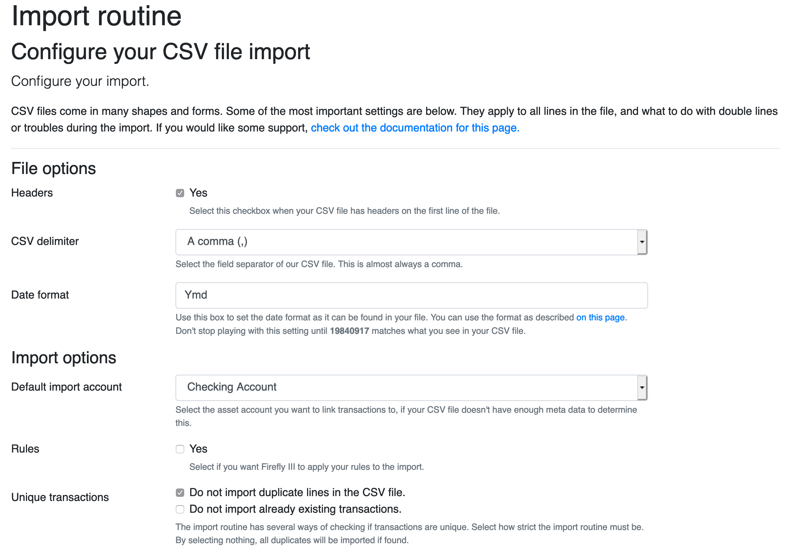

# Configure the import

This page contains instructions on how to configure your CSV import.

After uploading a file, you'll be presented with a list of options. Some may be set already because you've used a configuration file.

## File options

### Headers

Select this checkbox when your CSV file has headers on the first line of the file. 

### CSV delimiter

Select the field separator of our CSV file. This is almost always a comma.

### Date format

Use this box to set the date format as it can be found in your file. You can use the format as described [on this page](https://www.php.net/manual/en/function.date.php).

When you suffer from a bank that sends you CSV files with localized dates like the Dutch `24 mei 2020`, you can prepend your date format with a country code so the local date will be parsed correctly: `nl:d F Y`.

## Import options

### Default import account

Select the asset account you want to link transactions to, if your CSV file doesn't have enough meta data to determine this. 

### Rules

Select this  if you want Firefly III to apply your rules to the import. This may slow down the import.

### Unique transactions

The import can (but doesn't have to) ignore duplicate lines in your CSV file. If you want, it can also ignore already imported transactions so you'll never import duplicates.

## Bank-specific options

Here you'll find some fixes for common problems with bank's CSV files.

## Other options

If you want to, check the "skip form" button so you don't have to go through these options each time you start an import.

