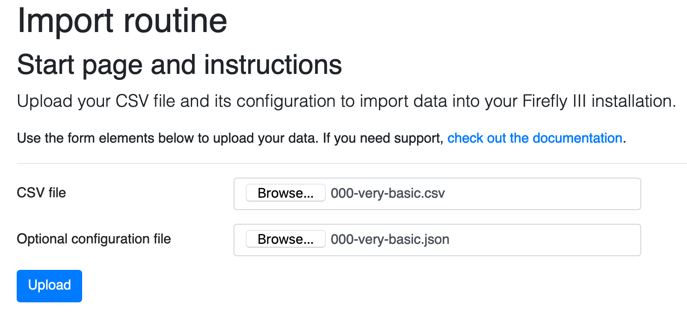

# Uploading files

On this page you'll find instructions on how to upload files into the CSV importer.

## About the CSV file

Always upload the CSV file from your bank. If the file contains any lines before the data starts, you must remove them manually. Make sure the file is encoded in UTF-8. Use a tool like Sublime Text or Notepad++ to convert the file if necessary. 

## About the configuration file

Configuration files contain instructions for the CSV processing. You can find a lot of common config files in the **[configuration file repository](https://github.com/firefly-iii/import-configurations)**.

If you want to know more about how the JSON file works, check out [this help page about the JSON configuration file](../help/json.md).

## Pre-uploaded configuration files

If you use the same config file over and over again, you can store this file in the `storage/configurations` directory. When you're using Docker, you can set the `JSON_CONFIGURATION_DIR` and map this to any directory in the Docker container. For example, you could do something like this:

```
docker run [..] -v /home/user/configurations:/configurations [..] -e JSON_CONFIGURATION_DIR=/configurations
```

In any case, if this directory contains file (there is no check if the files are valid in any way) they will be listed like so:


It is then up to you to select one (or not) and it will be used.

## Common problems and errors

- The file must be UTF8 encoded.
- No extra text may be present before or after the data.


