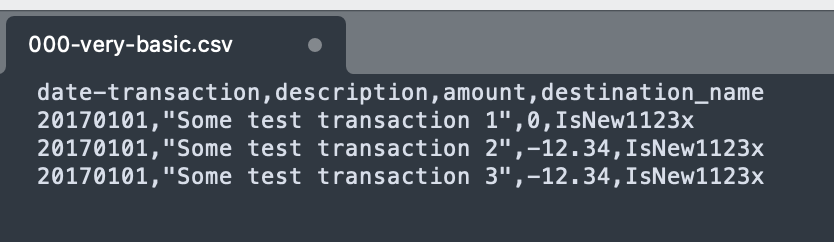
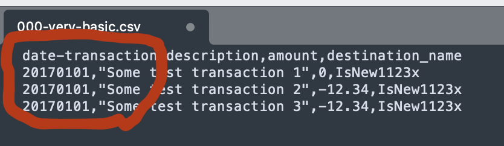
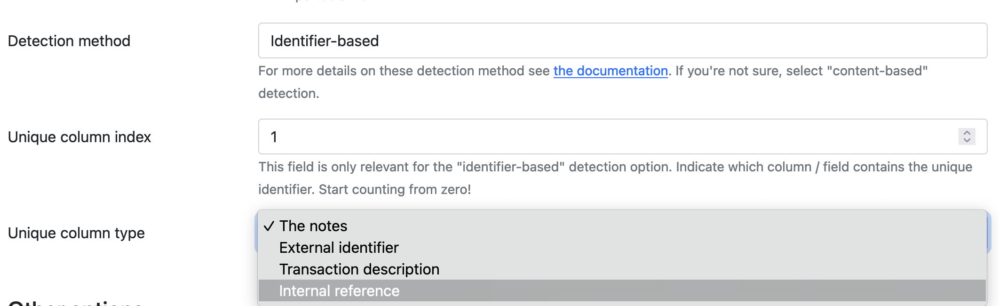

# Configure the import

After uploading a file, you'll be presented with a list of options. Some options are specific to a way of importing, like CSV files, Nordigen or Spectre. We start from the top and go down the page.

## Nordigen and Spectre import options

For Nordigen and Spectre you must first select the accounts to import from, and indicate in which account the data must be imported.

Your selection may be limited: if the IBAN matches you have no choice. If the currency matches, only accounts with that currency can be selected.

## CSV file options

### Headers

When you import a CSV file, this checkbox allows you to indicate if your CSV file has headers on the first line of the file instead of data.

### Convert to UTF-8

Some files are not delivered as UTF-8, which is a common text encoding format. You can ask the data importer to convert the files. You may end up with garbled text. This may happen especially when you have lines with special characters in them.

### CSV delimiter

When you import a CSV file, you must select the field separator of our CSV file. This is almost always a comma.

### Date format

This option sets the date format of the date entries in the CSV file. If your file contains internationalized dates, you can prefix the date format with your country code, like `it:` or `nl:`. Then, enter your date format.

Read more about the format in the [PHP documentation](https://www.php.net/manual/en/datetime.format.php).

Here are some examples:

* `Ymd`. Will convert `20210318`
* `F/j/Y`. Will convert `January/17/2021`
* `nl:d F Y`. Will convert Dutch date `5 mei 2021`

## Import options

### Default import account

Select the asset account you want to link transactions to, if your import doesn't have enough meta-data to determine this. This is some time useful when files just list the transactions and the destination, nothing more.

### Rules

Select this if you want Firefly III to apply your rules to the import. It is useful to run your rules after the import, so the transactions are cleaned up.

### Import tag

When you check this the data importer will add a tag to each imported transaction denoting the import; this groups your import under a tag. 

!!! note "Rules"
    If you have rules that remove all tags from a transaction, they will *not* work when you use this option. The tag will always be added. This is not because the data importer uses some magic trick. The tag is added *after* the transaction is created.

### Map data

If you import data, you can "map" the data found to data already present in Firefly III. You can use this to map account names in the CSV file to account names already in Firefly III. If you do not map data, Firefly III will make one-on-one to existing or to be created data.

### Date range

For Nordigen and Spectre imports, you can select a date range, limiting the import. Options are as follows:

- Import everything.
- Go back a number of days, weeks, months or years.
- Select a specific range to import from.

## Duplicate transaction detection

Checkout the [FAQ on duplicate transactions](../faq/duplicates.md) and the [FAQ on re-importing transactions](../faq/re-import.md) for more information. 

!!! info "Duplicate detection"
    If you're unsure about what setting to use, use content-based duplicate detection.

### General detection options

Sometimes imports contain duplicated lines. Use this option to remove them from your import. It almost never makes sense to import duplicate lines. These options don't apply to Nordigen and Spectre imports.

### Detection method

The data importer has three methods of duplicate detection. Select the one that fits your use case the most. Extra options may appear or disappear.

#### No duplicate detection

This is the choice to make when you want no duplicate detection. The data importer will just import *everything* in your data import.

#### Content-based

The data importer will submit all transactions to Firefly III, where they will be checked for duplications. If you ever submitted the exact same transaction before Firefly III will ignore it. This method even works when you edit the transactions in later stage. The duplicate will still be detected.

#### Identifier-based

Identifier-based duplicate detection is useful when your bank has very precise and complete statements. On the configuration page, select i which column your bank has a unique identifier, like a transaction ID. Also select the field on which this unique identifier can be stored.

When importing your data, the data importer will first search for this unique identifier in the selected column, before it will try to import the transaction.

## Other options

If you want to, check the "skip form" button, so you don't have to go through these options each time you start an import.
