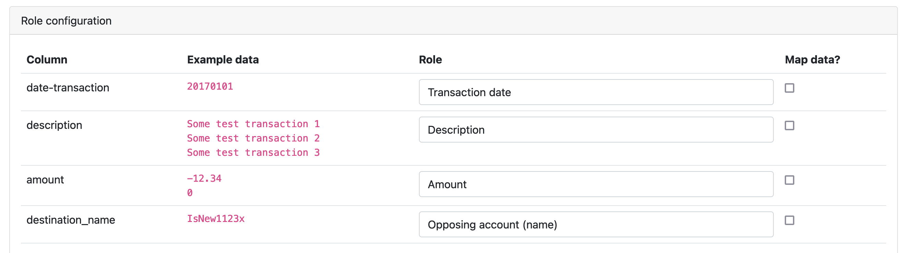

# Fine tune CSV imports

Next to the [configuration settings](configure-import.md) you also have options to further tune your CSV file import.

## CSV column roles

You have to tell the Firefly III data importer what each column means. The page looks something like this:



Each column must be given a role. You can of course, choose to ignore a column. These are the roles that you can choose from:

### (ignore this column)

Select this role to ignore the content of the column.

### Date

This sets the main date of the transaction. This date will be used for sorting transactions. If your CSV file also includes a timestamp *in the same column* you can include it in your date format, and it'll be parsed as well.

It's important to be consistent about the date you use. Especially when your CSV has several date fields. Choose the date closest to the actual transaction.

### Description

The description of the transaction. If you select multiple columns to be the description of the transaction, the columns will be concatenated together. 

### Asset account (\*)

These roles (several variations) are used to indicate the asset account in the transaction, usually your own. "Asset account ID (matching FF3)" is a special column that's only relevant when you import old data from Firefly III itself.

### Opposing account (\*)

These roles (in several variations) are used to indicate the opposing account. Usually these are stores or shops or opposing account details.

### Amount

Indicates the amount of the transaction. Use "Amount (negated column)" if the transactions get imported the wrong way around.

### Amount (in foreign currency)

Indicates the foreign amount of the transaction. Is always present next to the normal amount.

### Amount (credit / debit column)

Some banks split the amount in two columns. One for debits, one for credits. Use this column type for either field.

### Bill

Use this field to link the transaction to the right bill.

### Budget

Use this field to link the transaction to the right budget.

### Category

Use this field to link the transaction to the right category.

### Currency code / name / symbol

Use this field to set the currency of the transaction.

### Foreign currency code (ISO 4217)

Use this field to set the currency code of the foreign amount of the transaction.

### Meta date fields

Consists of:

- Interest calculation date
- Transaction booking date
- Transaction process date
- Transaction due date
- Transaction payment date
- Transaction invoice date

These are meta-dates related to the transaction you can set. Import these dates to make sure the data isn't lost.

Most people use the date that is closest to the actual transaction date as the main date (see earlier in the text about the "date" field). The other dates can be stored pretty much as you wish.

When reconciling transactions it might be useful to select the processing date of the bank as the date.

### External ID / Internal reference

Some banks give transactions their own ID's. Use this field to track them.

### Tags

The Firefly III can import space and comma separated tags.

### Note(s)

Any notes you wish to import. If you select multiple columns to be stored in the notes field, they will be concatenated together. It's not that column A will override column B, for example.

Multilines notes spanning to more than one line can be imported, just remember to close quotes correctly and to use [Markdown format](https://www.markdownguide.org/basic-syntax/#line-breaks):

> ```
> "this","is my","csv line","with my notes: to add a newline, finish a sentence with two spaces  
> and continue on the next line
> 
> or give a double enter"
> ```

In Firefly III you'll see the notes this way:


### Debit/credit indicator

The CSV importer supports the use of fields like "D" and "C" or "debit" and "credit" to indicate if the amount should be positive or negative.

### SEPA fields

The Firefly III CSV importer can import several [SEPA](https://en.wikipedia.org/wiki/Single_Euro_Payments_Area) related fields. As a rule, these are read-only after importing.

- SEPA end-to-end Identifier
- SEPA Opposing Account Identifier
- SEPA Mandate Identifier
- SEPA Clearing Code
- SEPA Creditor Identifier
- SEPA External Purpose
- SEPA Country Code
- SEPA Batch ID

### Other leftover fields

Many CSV files contain extra data. Things like zip codes, retention policies or other data that doesn't really fit in Firefly III can be stored in the "notes"-field. This doesn't make the data more easily accessible but at least it'll be saved.
