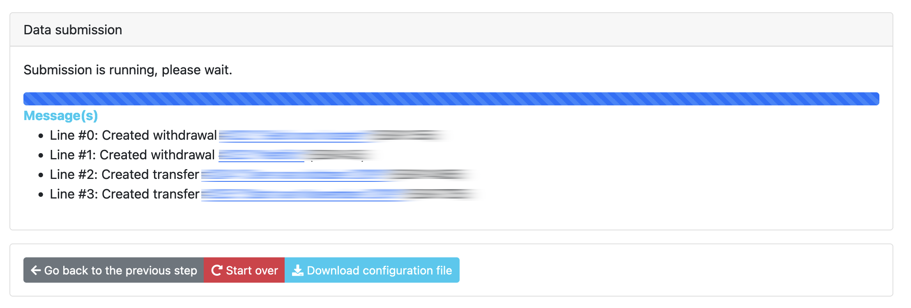

# Start the import

## Introduction

Once the configuration is set, the roles are determined and the mapping is done, you can finally start! Data import is a two-step process. First, you will be greeted by the screen below.

## Converting data

In this stage, the data will be parsed and converted into Firefly III compatible transactions. Note how you can download a configuration file. This configuration file contains all the details from the previous steps, and can be used to start a new import more quickly next time.

If you use Spectre or Nordigen, your MUST download the configuration file. Otherwise you have to authenticate to your bank all over again. 

## Submitting data

Once converted, it's time to submit the data to Firefly III. Each transaction is sent to Firefly III over the API.

## Errors and breakdowns

During these stages anything might happen! Check out the [FAQ](../faq/index.md) for more information.
