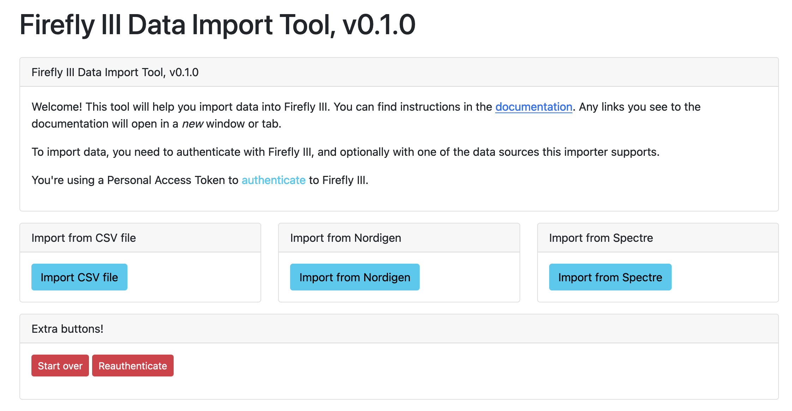

# Self hosted

In order to run the Firefly III Data Importer (**FIDI**) you need a working LAMP, LEMP or WAMP running PHP %PHPVERSION and access to the command line. Here are some Google queries to help you.

1. [Install a LAMP stack with PHP %PHPVERSION](https://www.google.com/search?q=lamp+stack+php+%PHPVERSION)
2. [Upgrade Ubuntu PHP %PHPVERSION](https://www.google.com/search?q=upgrade+ubuntu+php+%PHPVERSION)
3. [PHP %PHPVERSION raspberry pi](https://www.google.nl/search?q=PHP+%PHPVERSION+raspberry+pi)

!!! warning
    FIDI will not work properly when installed or accessed through a subdirectory on your web server. If you run FIDI from `/fidi`, `/importer` or a similar subdirectory your milage may vary and I can't support you.

## Preparing your server

### Extra packages

Install the following PHP modules:

* PHP BCMath Arbitrary Precision Mathematics
* PHP JSON

### Installing composer

You need to [install composer](https://getcomposer.org/doc/00-intro.md) or [download composer](https://getcomposer.org/download/).

If you're having trouble with (parts of) this step, please check out [the FAQ](../help/faq.md) or open an issue [on GitHub](https://github.com/firefly-iii/firefly-iii).

## Installing FIDI

### Main command

Browse to `/var/www`. Enter the following command. 

```bash
composer create-project firefly-iii/data-importer --no-dev --prefer-dist data-importer %IMPORTERVERSION
```

If this gives an error because of access rights, prepend the command with `sudo`. Then fix the access rights:

```bash   
sudo chown -R www-data:www-data data-importer
sudo chmod -R 775 data-importer/storage
```

In general, these access rights aren't terrible important for FIDI, as long as your web server can read all the files.

### Configuration

In the `data-importer` directory you will find a `.env` file. There are instructions what to do in this file. If you can't find this file, copy `.env.example` into `.env` and voila!

## Accessing FIDI

You can access FIDI at [http://localhost/](http://localhost/). If this URL is taken by Firefly III already, make sure your server configuration accepts both. This is called a "virtual host".

!!! warning
    A virtual host would entail setting up two (sub)domains like `firefly.local` and `fidi.local`.

### Browsing to site

Browsing to the site should be easy. You should see the following screen.



If this is not the case, or something is broken, be sure to open [an issue on GitHub](https://github.com/firefly-iii/firefly-iii) or check out [the FAQ](../help/faq.md).

## Reverse proxies

To run FIDI behind a reverse proxy, make sure you set the `TRUSTED_PROXIES` environment variable to either `*` or the IP address of your reverse proxy.

### TLS

To enable TLS in FIDI, your reverse proxy must send the right information to FIDI. Here is some code for nginx:

```
proxy_set_header X-Forwarded-Host $host;
proxy_set_header X-Forwarded-Server $host;
proxy_set_header X-Forwarded-Proto $scheme;
proxy_set_header X-Forwarded-For $proxy_add_x_forwarded_for;
proxy_set_header Host $host;
client_max_body_size 64M;
proxy_read_timeout 300s;
```
