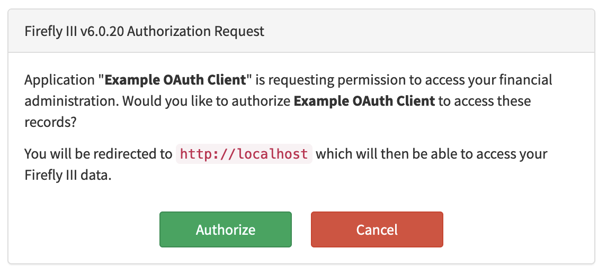

# Docker installation

## Together with Firefly III

You can run the data importer in a Docker Compose combination with Firefly III. A **[docker-compose-importer.yml](https://raw.githubusercontent.com/firefly-iii/docker/main/docker-compose-importer.yml)** is available on GitHub. Download the raw file and store it in a directory of your choice as `docker-compose.yml`.

Then, download the environment variable files:

- Download the `.env.example` file for Firefly III [from the Firefly III repository](https://raw.githubusercontent.com/firefly-iii/firefly-iii/main/.env.example). Save the raw file as `.env` next to the docker compose file.
- Download the `.env.example` file from the [Data Importer repository](https://raw.githubusercontent.com/firefly-iii/data-importer/main/.env.example) and save it as `.importer.env` next to the other files.
- The final file (`database.env`) contains the database variables and can be downloaded from [the Docker repository](https://raw.githubusercontent.com/firefly-iii/docker/main/database.env). Save it as a new file called `.db.env`.

If you save all example files and change nothing, it will NOT YET work. You must do a few things: 

1. Change `DB_PASSWORD` in `.env` to something else. Pick a nice password.
2. Also change `MYSQL_PASSWORD` in `.db.env` to the SAME value
3. Change `FIREFLY_III_URL` in `.importer.env` to `http://app:8080`
4. Change `VANITY_URL` in `.importer.env` to `http://localhost`

!!! note
    Change the password FIRST. If you change the password *after* you started Docker, it will complain about having no access.

Run the following command in the directory where all files are present.

```text
docker compose -f docker-compose.yml up -d --pull=always
```

You can follow the progress of the installation by running this command:

```text
docker compose -f docker-compose.yml logs -f
```

When the installation is done, Firefly III will thank you for installing it. Once you see this message, you can visit Firefly III. It will be running at [http://localhost](http://localhost).


### Register a new account

Register a new account and create your first account at Firefly III, running at [http://localhost](http://localhost).

### Create asset accounts

Under Accounts > Asset accounts, do two things:

1. Create any missing accounts (savings accounts, credit cards, etc) and be sure to add the account number or IBAN.
2. Edit the original account and add the account number or IBAN.

### Create an access token

!!! info "Callback URL"
    The callback URL will be `http://localhost:81/callback`

1. In Firefly III at [http://localhost](http://localhost), browse to Profile > OAuth
2. Create a new client ID [according to these instructions](configuration.md#client-id-firefly-iii-url).

### Browse to the data importer

Now, browse to the data importer. It will be running at [http://localhost:81/](http://localhost:81/).

Enter the Client ID from the previous step. In my example, it is "3":


Press the button to Authenticate. You should give permission on the next screen. Note how the name of your client is reflected in the question:



You should get back on the Data Importer index:


You are now ready to go!

## Single installation

To run the Data Importer using the following `run` command. You will start a web server on port 8081 that will allow you to use the data importer.  

Append the command with your Personal Access Token and Firefly III URL. The values you need and where to get them are explained on the **[Configuration page](configuration.md)**. Note that most people don't use Nordigen *and* Spectre values at the same time.

All environment variables are optional, but convenient.

```bash
docker run \
-e FIREFLY_III_ACCESS_TOKEN=(here) \
-e FIREFLY_III_URL=(here) \
-e NORDIGEN_ID=(here) \
-e NORDIGEN_KEY=(here) \
-e SPECTRE_APP_ID=(here) \
-e SPECTRE_SECRET=(here) \
-p 8081:8080 \
fireflyiii/data-importer:latest

```

!!! note
    Change `docker run` to `docker run -d` so the image runs in the background.

!!! ip
    You may need to clear your cookies, browse to `/flush` or press \[Reauthenticate\] after changing the environment variables.


