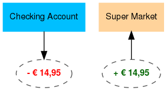

# Transactions

See also: 

- [Tutorial: Create accounts and transactions](../../tutorials/finances/first-steps.md)
- [How to organize transactions](../../how-to/firefly-iii/finances/transactions.md)
- [A reference to all transaction types](../../references/firefly-iii/transaction-types.md)

## What is a transaction in Firefly III?

Money moves from A to B. It doesn't matter if this is an expense, your salary or you moving money around: _money moves from A to B_:

In Firefly III and most other systems this is stored using a "[double-entry bookkeeping system](http://en.wikipedia.org/wiki/Double-entry_bookkeeping_system)". You get money and your boss loses it. You spend money and the Supermarket "earns" it:

Each transaction is stored twice. Once as a loss (for one party), and once as a profit (for the other party). This seems pretty pointless, and technically it is. But it was designed back when clerks could be fraudulent and this double-entry system stopped fraud. In these modern days it is useful to check if all records are straight.

It is also useful when transferring money back and forth between your own accounts. This is the same as spending money. It's all moving money around. This helps maintain the internal consistency of the database.

## What are split transactions?

What has been described here are "singular transactions". Firefly III stores each financial transaction in a journal. Each journal contains two "transactions". One takes money (-250 from your bank account) and the other one puts it into another account (+250 for Amazon.com).

You can verify this by counting. There are always twice as many "transactions" as there are "journals" in your database.

This way, Firefly III tries to stay true to what a financial transaction is, which is kind of singular. Money moves from A to B, end of story. Nothing more.

However, often an expense tells a story. Take grocery receipts for example. It's one expense sure, but it consists of many parts. And when you buy aspirin and bread at the same time, you might want to split the expense over two budgets, medication and groceries. A single expense would make you lose information.

Likewise, your salary may have multiple components. Your base salary may be 1200. Plus 100 bonus. Etc. All that information is lost when you enter it using a singular, not split deposit.

Any time you create a deposit, transfer or a withdrawal, Firefly III lets you **split** a transaction into multiple parts. When you do this, you can:

* Assign part of an expense to a budget;
* Assign different revenue accounts to parts of a deposit.
* Categorize money differently.

You can split your entire groceries-receipt into small "sub"-transactions. Or you can specify each component of your salary.

### Constraints

It's important to realise the following constraints when dealing with split transactions.

* When making an expense (withdrawal), you can only split the destination accounts, not the source accounts. You can't create one expense that originates from two or three asset accounts. But you can divide a withdrawal over several expense accounts. You can split your groceries over several departments, but you can't pay a bill from two asset accounts.
* Deposits must end up in one asset account. You can't make a deposit from one revenue accounts and split it over separate asset accounts. Your salary, when divided over different splits, must end up in one asset account.
* Transfers can be split, but all splits must have the same source + destination.
