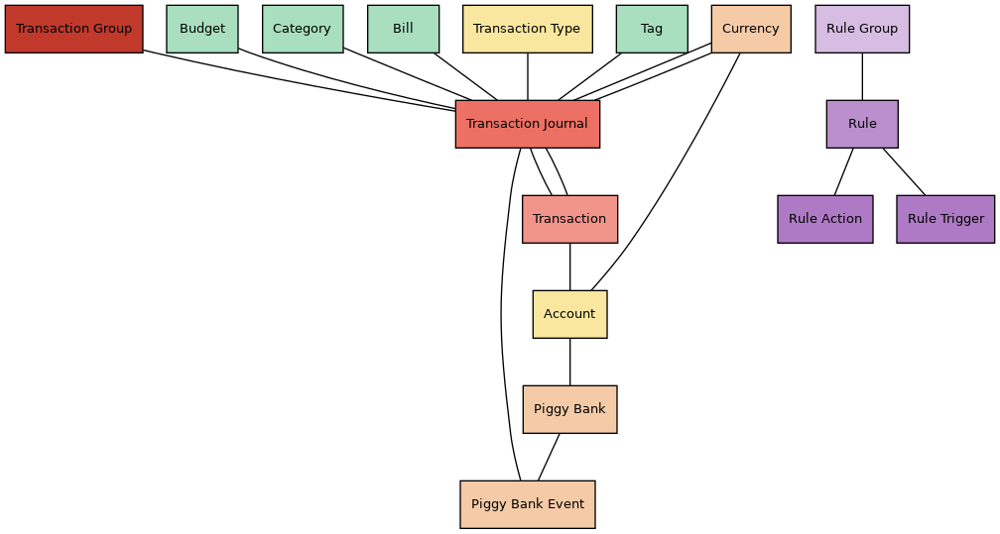

# Architecture

On this page you'll find information about the internal architecture of Firefly III. It's not meant as an explanation of where everything is but rather as a means to show you how everything is structured. If you ever want to develop something these pages should show you where you need be.

!!! info
    This page is under construction. Feedback is welcome!

## Database

These images show you a graphical overview of the most important parts of the database. There are many more tables, but these are the important objects you may want to learn about. If you see something in the database you're curious about, please let me know.

### Transactions

In the picture, objects related to transactions are shown in shades of red. A "transaction group" ties multiple "transaction journals" together. Each transaction journal contains exactly two transactions. A transaction either removes or adds money from an account. A basic withdrawal or expense in Firefly III consists of: 

- One transaction group to tie everything together.
- One transaction journal to link two transactions.
- One transaction removing money from account A.
- One transaction adding money to account B.

A split transaction is one "transaction group" that contains *X* "transaction journals", one for each split. Each transaction journal contains two transactions. The amount of the witdrawal is stored in the transaction.

Accounts and transaction journals can have a currency assigned to it. Transaction journals may also have a "foreign" currency assigned to it, which is another reference to a currency object.

Transaction journals have meta data like categories, budgets and bills and tags.

Accounts are linked to transactions and to piggy banks. A transfer (see transaction type) may link a transaction journal to a piggy bank in a piggy bank event. Together they form the history of the piggy bank. A piggy bank event may exist without a link to a transaction journal.

### Rules

Rule groups contain rules. Rules have actions and triggers. Although actions and triggers may reference to budgets, categories and tags and other things, there is no database relationship. 

### Recurring transactions

A recurring transaction has some basic information and an X number of transactions, which means it's possible to make a "split" recurring transaction. It's also possible to create multiple "repetitions", that define when a recurrence fires. This data is used by the recurring cronjob to create the exact transaction as defined in the transaction definition, whenever a repetition says its time.

### Webhooks

Webhooks have a related object called the "webhook message" that contains the content of that particular moment the webhook fired and if it succeeded.

## Code

Firefly III is based on [Laravel](https://laravel.com/), and uses the MVC model. There is a number of design patterns used throughout the code. Listed here are the most important *directories* and what they contain. Some design patterns use more directories than what you see here, so be sure to also check out the [Design Patterns](#design-patterns) below.

### Models

Models are stored in `app/Models`. Everything in the Firefly III database has an associated model. Most models also have a `routeBinder` function that tells if an URL parameter is valid. Some tables in the database are used to link data together, which means they don't have a model. 

### Views

All the views are stored in `resources/views/`. There is a v1 and a v2 folder. The v1 folder contains the HTML-based views you know and love. The v2 folder contains the views for the new layout, which will be a Vue app. As such the v2 views are fairly basic (empty). Views are Twig files.

### Controllers

Most pages are generated by controllers in `app/Http/Controllers`. They're grouped around objects (rules, transactions, etc) and mostly follow a CRUD-model.

- IndexController
- CreateController

There are specific controllers for the charts, some JSON controllers and some notable exceptions. Most of this code will have to move to the API, because I plan to make the new layout (v2) API-only. That means that the controllers in the `app/Api` directory will become leading.

### API

The API code is stored in `app/Api` and consists of controllers, some basic middleware and request classes. The API code is pretty consistent: store or update objects, make some lists and transform the data into JSON. The requests can be interesting because in those requests the rules are stored that define what you can submit. The API will become the main interaction method for ALL frontend code in Firefly III, which means it will have to be greatly expanded.

### Generators

- The Chart generators in `app/Generator` render specific arrays into chart.js compatible arrays (which in turn, are returned to the user as JSON).
- The Report generators in `app/Generator` are kind of deprecated. They used to generate one huge array with the report in it that the user requested. This got pretty slow pretty fast, so now the generators only do the basic stuff. Each box on your favorite report is requested using AJAX / JSON from a dedicated controller in `app/Http/Controllers/Report`. This feels a lot snappier.
- The Webhook generator is a small piece of code that generates the actual message used in webhooks.

### Helpers

The `app/Helpers` contains some generic code used for reports, the help, and updates. It's a place for all of those things I couldn't think of a better place for. The transaction collector is kind of special and is detailed in another section.

### Jobs

Some of the work that Firefly III needs to do is complex or time consuming, so it's packed in a job. In `app/Jobs` you'll find some of the things either triggered by cron jobs or by other things.

### Validation rules

Validation rules are stored in `app/Rules` and `app/Validation`. It's one thing to validate if a number is larger than zero. But some of the validation rules for transactions used by Firefly III are pretty complex, because there's a lot of context.

### Services

The idea of `app/Services` was that any external service would have its code and interfaces in this folder. This applies to the update checker, the webhooks and the password verifier. However, there's also a few "internal" services. Creating a transaction or account from beginning to end is complex so these services tie it all together.

### Support classes

In the `app/Support` directory you will find a bunch of support code for all kinds of functions and things in Firefly III. Just like the `app/Helpers` folder it seems to collect all kinds of code snippets that have nowhere else to go.

### Translations

All languages are stored in `resources/lang`. The main language is `en_US`, all other translations are derived from the English text. If you want to support the translations, check out [Crowdin](https://crowdin.com/project/firefly-iii).

## Design Patterns

Apart from the [code](#code) in the previous section there are some design patterns in use that don't really focus on specific folders specifically but rather have a design that spans more than one part of the code base.

### Transaction collection, search and rules

The single biggest piece of code in Firefly III is the **transaction collector**. This is an interface with lots of functions that is designed to collect (you guessed it) transactions. In the code you give the collector parameters like date-ranges, accounts or search queries. You then collect the results and use it in lists, or in rule actions or whatever. This is basically one big database query.

There are two schools of thought when it comes to transaction collection. Each page, each view and each report has its own set of transactions it wants to show *and* a specific set of meta-data it needs. In earlier times each controller would have its own code to grab transactions from the database. This is very hard to maintain, although it makes each query very efficient. A transaction collector is less effective than writing dedicated queries but it does save a lot of code.

Check out `app/Helpers/Collector/GroupCollectorInterface.php`

There is an `OperatorQuerySearch` class stored in `app/Support/Search` that converts the search query of the user into a transaction collector. The collector does its work and the result is shown to the user.

Stored in the folder `app/TransactionRules/Engine` is the rule engine. It works just like the search does. It uses the rule triggers to build a search query. The query is executed by the transaction collector. The transactions that are found are then handled by the actions in the `Actions` folder. The engine ties all of this together.

### Events

Some events in Firefly III trigger more code. File `app/Providers/EventServiceProvider.php` shows you all events (also listed in `app/Events`) and the class + method that will trigger if the event happens. Some events trigger multiple handlers. The code of the handlers is in `app/Handlers`.

### Factories

Most objects in Firefly III are complicated things. Just look at the structure of a transaction. In a worst-case scenario a new split withdrawal results in 13 new objects. The various factories in `app/Factory` handle this. If you start with the `TransactionGroupFactory` you can go down the rabbit hole of transaction creation in Firefly III.

### Webhooks

TODO

### Repositories

The repository design pattern basically says that you don't query your models directly but ask a repository to list or create what you need, and then the repository takes care of it. It's a weird pattern because usually you have this repository interface and just a single implementation making the interface kind of overhead. But I like the idea.

These repositories do a lot of the heavy lifting when it comes to specific models and their demands from various parts of the code (search for, list, summarize). The "store"- and "update"-methods that these repositories contain are mostly taken over by factories.

### Frontend

The `/frontend` folder contains the code of the new Vue frontend. Check out `src` for all the details. It's a Vue based frontend with separate pages. In the future, I hope to create an SPA, but for now it's separate pages, supported by views from `resources/views/v2`.
