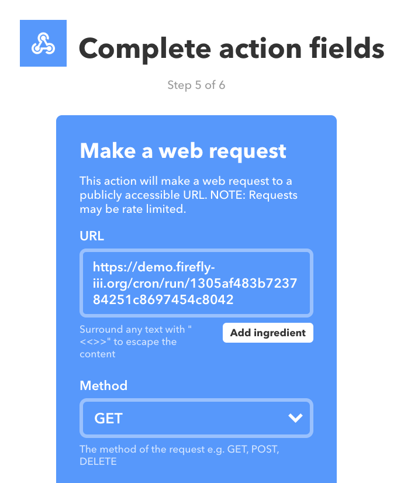

# Cron jobs

Firefly III has several feature that will only work when the cron job is running.

## Calling a command

If you are a bit of a Linux geek you can set up a cron job easily by running `crontab -e` on the command line. Some users may have to run `sudo crontab -u www-data -e` so the correct user will be referred to.

```   
# cron job for Firefly III
0 3 * * * /usr/bin/php /var/www/html/artisan firefly-iii:cron
```

## Request a page over the web

You can also use a tool called cURL.

```
# cron job for Firefly III using cURL
0 3 * * * curl https://demo.firefly-iii.org/api/v1/cron/[token]
```

The `[token]` value can be found on your `/profile` under the "Command line token" header. This will prevent others from spamming your cron job URL. An alternative to this token value is the `STATIC_CRON_TOKEN` environment variable. You can set this using the `.env` file, or by setting it through Docker. A little ahead on this page the difference is explained. 

```

### Systemd timer

You can use `systemd` to run the jobs on a recurring schedule similar to cron. You will need to create two files: a unit file and a timer file.

Begin by creating a new file instructing systemd what to run, `firefly-iii-cron.service`.

```ini
[Unit]
Description=Firefly III recurring transactions
Requires=httpd.service php-fpm.service postgresql.service

[Service]
Type=oneshot
ExecStart=/usr/bin/php /var/www/html/artisan firefly-iii:cron
```

You will want to change the `Requires=` line to match the services that you are actually running. In this example we are using httpd (Apache), PHP FastCGI Process Manager (FPM), and PostgreSQL. Similarly, change the path to *your* path to the PHP binary and the path to *your* Firefly III installation.

Next create a new file for the timer specification, `firefly-iii-cron.timer`.

```ini
[Unit]
Description=Firefly III recurring transactions

[Timer]
OnCalendar=daily

[Install]
WantedBy=timers.target
```

Copy these files to `/etc/systemd/system`. You must then enable (`systemctl enable firefly-iii-cron.timer`) and start (`systemctl start firefly-iii-cron.timer`) the timer. Verify the timer is registered with `systemctl --list-timers`. You may also want to run the service once manually to ensure it runs successfully: `systemctl start firefly-iii-cron.service`. You can check the results with `journalctl -u firefly-iii-cron`.

## IFTTT

You can always use [If This, Then That (IFTTT)](https://ifttt.com). This will only work if your Firefly III installation can be reached from the internet. Here's what you do.

Login to IFTTT (or register a new account) and create a new applet:


You will get this screen. Select "This":


Select "Date and Time":


Select "Every day at":


Set the time to 3AM:


Click on "That":


Use the search bar to search for "Webhooks".


Click on "make a web request"


Enter the URL in the following format. Keep in mind that the image shows the WRONG URL. Sorry about that.

`https://your-firefly-installation.com/api/v1/cron/[token]`

The `[token]` value can be found on your `/profile` under the "Command line token" header. This will prevent others from spamming your cron job URL. An alternative to this token value is the `STATIC_CRON_TOKEN` environment variable. You can set this using the `.env` file, or by setting it through Docker. A little ahead on this page the difference is explained.



Press Finish to finish up. You can change the title of the IFTTT applet into something more descriptive, if you want to.


You will see a final overview


Press Finish, and you're done!

## Cron jobs in Docker

The Docker image does *not* support cron jobs.

### Static cron token

The web address for the cron job is protected by a token. You can find this token on the `/profile` page under "Command line token". This token is dynamic, and is generated anew for each user.

When you use Docker, this can be difficult to configure. So, you can set the `STATIC_CRON_TOKEN` to a string of **exactly** 32 characters. This will also be accepted as cron token. 

For example, use `-e STATIC_CRON_TOKEN=klI0JEC7TkDisfFuyjbRsIqATxmH5qRW`.

So there are two kinds of tokens you can use. The personal token from your `/profile` page, or a self-generated 32-character token.

```
# cron job for Firefly III using cURL
0 3 * * * curl https://demo.firefly-iii.org/api/v1/cron/klI0JEC7TkDisfFuyjbRsIqATxmH5qRW
```


### Call the cron job from outside the Docker container

Use any tool or system to call the URL. See the preceding documentation.

### Call the cron job from the host system

The command would be something like this:

```
0 3 * * * docker exec $(docker container ls -a -f name=firefly --format="{{.ID}}") /usr/local/bin/php /var/www/html/artisan firefly-iii:cron
```

### Run an image that calls the cron job

Here's an example:

```
docker create --name=FireflyIII-Cronjob alpine \
    sh -c "echo \"0 3 * * * wget -qO- https://demo.firefly-iii.org/api/v1/cron/[TOKEN]\" | crontab - && crond -f -L /dev/stdout"
```

The `[token]` value can be found on your `/profile` under the "Command line token" header. Earlier on this page, you can read on the static token as well.

If you do not know the Firefly III URL, you can also use the Docker IP address.

### Expand the docker compose file

```
cron:
  image: alpine
  command: sh -c "echo \"0 3 * * * wget -qO- http://app:8080/api/v1/cron/[TOKEN]\" | crontab - && crond -f -L /dev/stdout"
```

The `[token]` value can be found on your `/profile` under the "Command line token" header. Earlier on this page, you can read on the static token as well.

## Extra information

In order to trigger "future" cron jobs, you can call the cron job with `--force --date=YYYY-MM-DD`. This will make Firefly III pretend it's another day. This is useful for recurring transactions. Here is an example of a cron job that is triggered every first day of the month at 3am and pretends it's the tenth day of that month.

```
# cronjob for Firefly III that changes the target date.
0 3 1 * * /usr/bin/php /var/www/html/artisan firefly-iii:cron --force --date=$(date "+\%Y-\%m-")10
```
