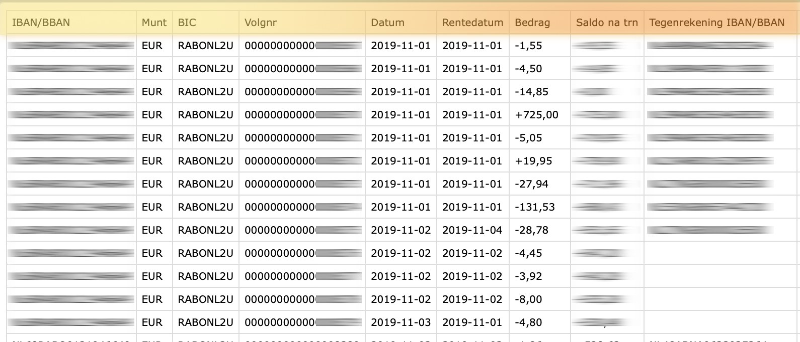

# How to import CSV files

A short how-to guide on how to import (complicated) CSV files using the Data Importer. This guide assumes you have the Data Importer working and running.

## Get your CSV file

Before you start, make sure you know the following things about your CSV file:

- Whether it has headers
- What the delimiter is
- What each column contains

You'll have to compare the column contents with [this reference of all "roles"](../../../references/data-importer/roles.md) that
a column can be. Pretty basic standards are the date of the transaction or the amount, but there are a few special options.

## Upload and get to the configuration screen

When you upload a file and get to the configuration screen, please validate the configuration with the properties of your
CSV file (see above).

Most options are explained on the configuration page itself, but the most important options are below:

### Headers

When you import a CSV file, this checkbox allows you to indicate if your CSV file has headers on the first line of the file instead of data.

### Convert to UTF-8

Some files are not delivered as UTF-8, which is a common text encoding format. You can ask the data importer to convert the files. You may end up with garbled text. This may happen especially when you have lines with special characters in them.

### CSV delimiter

When you import a CSV file, you must select the field separator of our CSV file. This is almost always a comma.

### Date format

This option sets the date format of the date entries in the CSV file. If your file contains internationalized dates, you can prefix the date format with your country code, like `it:` or `nl:`. Then, enter your date format.

Read more about the format in the [PHP documentation](https://www.php.net/manual/en/datetime.format.php).

Here are some examples:

* `Ymd`. Will convert `20210318`
* `F/j/Y`. Will convert `January/17/2021`
* `nl:d F Y`. Will convert Dutch date `5 mei 2021`

## Import options

### Default import account

Select the asset account you want to link transactions to, if your import doesn't have enough meta-data to determine this. This is some time useful when files just list the transactions and the destination, nothing more.

### Rules

Select this if you want Firefly III to apply your rules to the import. It is useful to run your rules after the import, so the transactions are cleaned up.

### Import tag

When you check this the data importer will add a tag to each imported transaction denoting the import; this groups your import under a tag.

!!! note "Rules"
    If you have rules that remove all tags from a transaction, they will *not* work when you use this option. The tag will always be added. This is not because the data importer uses some magic trick. The tag is added *after* the transaction is created.

### Custom import tag

You can set a custom import tag if you do not like the default one. To learn more about the possibilities, read the [FAQ on custom import tags](../../../how-to/data-importer/advanced/custom-import-tag.md).

Also think about the duplicate detection method you wish to use. If you're not sure which one you want to use, please check out the
[reference guide on duplicate detection](../../../references/data-importer/duplicate-detection.md), and make sure you read [how to handle (missed) duplicates](duplicates.md).

The date options are explained on the page itself, and other options should be fairly clear. There's also a guide on [how to map data](map-data.md), if you want to link your CSV data to Firefly III data more easily.

## Select roles

Earlier you validated what the columns your CSV file contain. Select the correct roles for your data using [the role reference](../../../references/data-importer/roles.md).

## Mapping data

There is a full [how to on mapping data](map-data.md) that you should really check out.

## Import the data

The import process consists of two steps. First a conversion and data validation. Then, the data will actually be sent to Firefly III.

Press "Start Job" to start the conversion and validation process. If this is successful, you can press "Start Job" after a few moments to import the data.

Each step can run into plenty of errors. Most of them are documented in [this FAQ](../../../references/faq/data-importer/import.md), but I'm pretty sure I missed a few. Please refer to the [support page](../../../references/support.md) if you need help.
