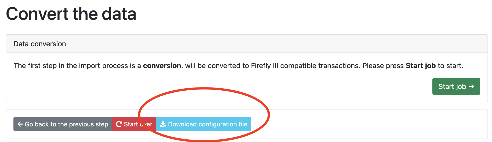
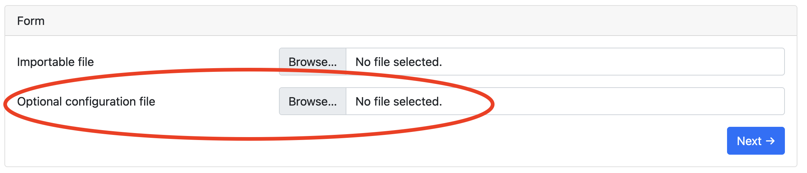

# How to manage JSON configuration files

The Data Importer uses JSON files that store your configuration. Once you are happy with your import configuration, you can run the import again and again using the same configuration file. This how-to explains how to do that.

There is an extensive reference on the exact content of [the JSON configuration file](../../../references/data-importer/json.md).

## The first import

Import some data. Use the other how-to guides or the tutorials to learn how to do this. During the conversion step, you will see this button:



When you press "Download configuration file", a JSON file is downloaded to your computer. Save that file somewhere safe. You can use it to run the import again.

## The second import

You may have noticed that the importer has a second upload field:



Use this field to add the JSON file to your import. As you can see, the importer will use the configuration from the JSON file instead of asking you to configure the import again.

## Pre-setting the configuration file


You can store pre-made configuration files in the data importer. This can be useful if you import regularly.

- Store the files in `storage/configurations`
- Mount a local directory to the `/var/www/html/storage/configurations` directory in Docker.
- Change the `JSON_CONFIGURATION_DIR` to any custom directory (mount it if you want to), and place them there.

With Docker:

```
docker run [..] -v /home/user/configurations:/configurations [..] -e JSON_CONFIGURATION_DIR=/configurations
```

This will show a dropdown with your JSON files ready to be selected:


## Download existing configuration files from other users

There's a repository on GitHub with [import configurations](https://github.com/firefly-iii/import-configurations) for common banks and financial institutions.
 
Use these configuration files to make your own import a lot easier to manage.
