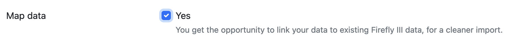

# How to map data

Any time you import data, you'll see that your bank tends to deliver messy transactions. The shop names are a riddle, and the descriptions are very strange. Often the only thing that's correct is the amount.

There are several ways to deal with this. You can use [rules](../../firefly-iii/features/rules.md) to clean up the transactions after the import. You can also use [webhooks](../../firefly-iii/features/webhooks.md) for more advanced stuff.

But the data importer allows you to "map" data to existing data in Firefly III. You can map account names, currency names, categories and many other fields to values already present in your Firefly III database. This will greatly smooth out the import process.

## What is mapping?

Mapping is a process where you link account names, category names and other fields in your import to data already present in Firefly III. If you do not map data, the Data Importer will use the data "as is". This may lead to messy imports.

## When do I map data?

When you import data, you get the option offered to map data on the Configuration screen.

If you check that box, you will get an option to map data later in the import process.

## How do I map data?

Here is a screenshot of an import where many names need to be mapped. I have taken the liberty of censoring some names.

In the third column you see how the data importer would just import everything as-is. If you don't want that, use the dropdown to select the correct opposing expense, revenue or asset account that the value needs to be linked to instead.

!!! tip "This is my first import, I don't have those accounts yet"
    You can go to Firefly III (in another tab) and create the accounts you're missing. If you refresh the page, they will be visible and selectable.

Here's an example where I mapped all weird "Albert Heijn"-transactions to a single expense account called "Albert Heijn".

## Now what?

Continue with the import process. After the import is complete, be sure to download the configuration file. This configuration file contains all your mappings, so you don't have to do those again next time.

