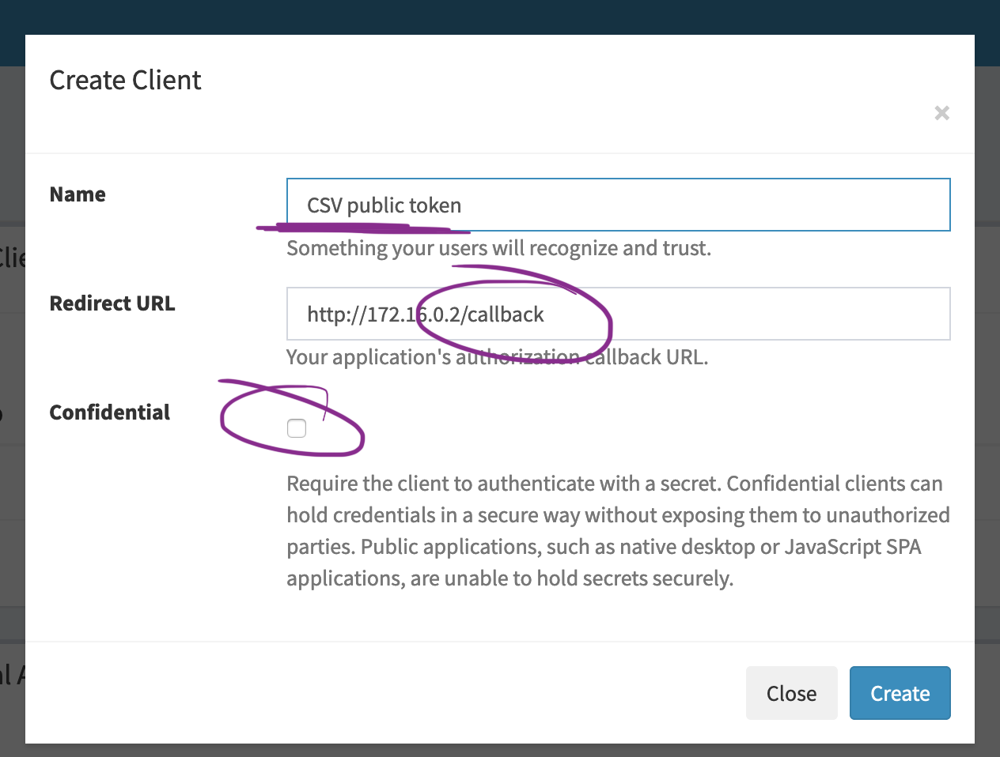

# How to talk to the API

To read more about Personal Access Tokens, check out the bottom of this page.

## Authentication

The API uses the OAuth2 workflow. You need to create OAuth2 Clients in your profile when logged in.


These clients have a secret (visible in the screenshot). The secret can be exchanged for an access token. The access token is used to access the API.

Firefly III offers the following end points that can be used in applications that support the OAuth2 workflow, such as Postman.

* `/oauth/authorize`
* `/oauth/token`


Here you see how Postman would use the secret to get an access token. What you can build in OAuth2 is out of the scope of this document.

## Personal Access Token

Some technical background. If your application can't or won't use OAuth2 (like the Firefly III CSV importer) you must generate a Personal Access Token on your profile page.

Go to your profile page (visit `/profile`) and follow these instructions:

Click on "create new token":


Give your token a name you recognize:


Copy the entire token. Yes, it's very long!


To use the token you have to pass an `Authorization: Bearer <token>` HTTP header. As an example in curl:

```bash
curl -X GET 'https://your-domain/api/v1/webhooks' \
  -H 'accept: application/vnd.api+json' \
  -H 'Authorization: Bearer [Personal Auth Token]' \
  -H 'Content-Type: application/json'
```


## How to get these variables?

### Personal Access Token

You can generate your own Personal Access Token on the Profile page. Login to your Firefly III instance, go to "Options" > "Profile" > "OAuth" and find "Personal Access Tokens". Create a new Personal Access Token by clicking on "Create New Token". Give it a recognizable name and press "Create". The Personal Access Token is pretty long. Use a tool like Notepad++ or Visual Studio Code to copy-and-paste it.


### Client ID + Firefly III URL

You can generate your own client ID on your Profile page (under OAuth). This is the ID you need when you want to share the data importer with multiple people, or when you want to allow others to use the same instance of the data importer.

Uncheck the "confidential" checkbox.

## Callback URL

It is **very important** that the callback URL is correct. The callback is the following:

```
http://[DATA IMPORTER]/callback
```

Some common examples include:

* [http://172.16.0.2/callback](http://172.16.0.2/callback) (172.16 is a common IP range for Docker hosts)
* [https://data-importer.home/callback](https://data-importer.home/callback) (Some users have fancy local addresses. Notice the TLS)
* [http://10.0.0.15/callback](http://10.0.0.15/callback) (10.0.0.x is often used when using Vagrant)

But ALWAYS add `/callback` or you'll run into weird errors later.



