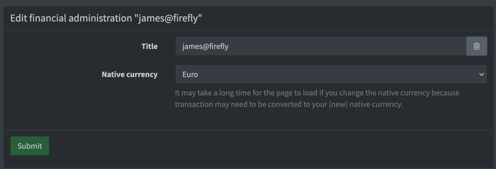
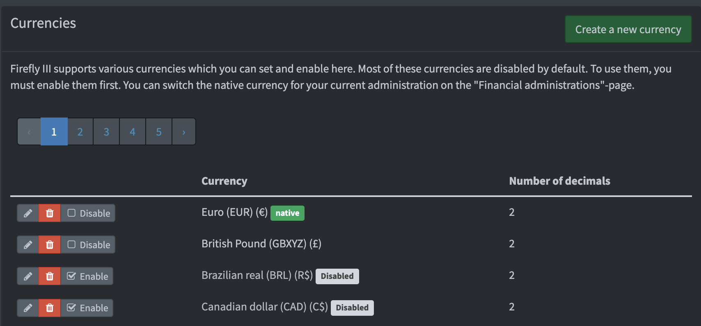

# How to use currencies 

Most currencies are disabled by default, meaning that you cannot use them when creating asset accounts or transactions. You must enable them first.

Under Options &gt; Preferences you will find the "Currencies" page. When you are an admin, you will see the button "Create a new currency". You should enter some details such as the name, the symbol of the currency and of course the currency code (preferably according to the [ISO 4217](https://www.currency-iso.org/dam/downloads/lists/list_one.xml) standard).

Currencies have decimal places. Most have 2, like the Euro. Notable exceptions are most cryptocurrencies (8 to 12) and the Mauritanian ouguiya (no decimals). Firefly III supports up to 8 decimals.

Please note that each currency needs:

- A symbol, such as $ or € or something else.
- A code, such as EUR or USD or something you make up.
- A name, of course.

Currencies tend to have 2 decimal places. You should check out Wikipedia for more information about your preferred currency, if you are unsure. If you want to know what the values are for your currency, check out [this list of currencies](https://github.com/xsolla/currency-format/blob/master/currency-format.json) on GitHub. New currencies are enabled by default.

## How-to add a currency

New currencies added through this form will be enabled for use.

## Set the native currency

Firefly III support multiple currencies, and each administration has a native currency. When you install Firefly III this is the Euro. You can change this if you want to.

Go to Options > Financial administrations (or `/administrations`) and under Actions, click "Edit". Here you can set the native currency for your current financial administration.

On the overview of your currencies at `/currencies` you can see ALL currencies (disabled en enabled):

## Set currency for asset accounts

Asset accounts have one main currency. My personal bank accounts are in Euro. But I have a credit card in USD. You can set this when you create or edit an asset account. This is important when you create or import transactions.

## Creating transactions

When you try to create a transaction in Euro's on an asset account that in US Dollars, you must set the amount in both USD and EUR.

## Creating transfers

When you create a transfer between an account in EUR and USD (or other currencies) you must also indicate the amount transferred in both currencies.

