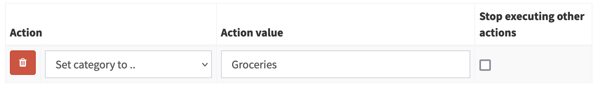
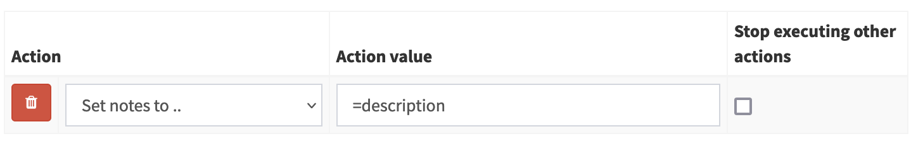
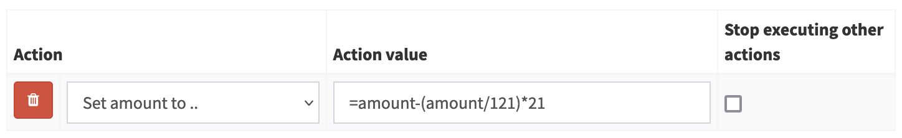
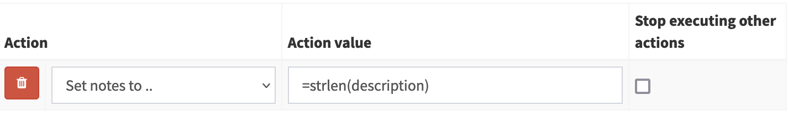
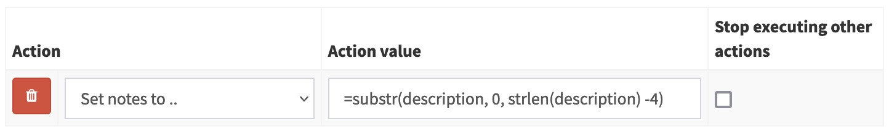
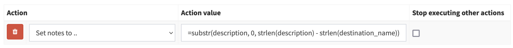

# How to use expressions in rules?

!!! warning "Firefly III v6.1.20"
    This feature is enabled in Firefly III v6.1.20 and later

## Introduction

Once you've learned [how to use rules](rules.md), you may think that rule *actions* are pretty plain. You can update some fields, but it's all pretty static. That's where expressions come in.

Thanks to GitHub user [@michaelhthomas](https://github.com/michaelhthomas) the rule actions now support the Symfony expression engine. This means that you can write a complicate "expression" that result in a new piece of text, or a new value. Depending on the action that you choose, you can do some pretty cool things.

!!! info "Full syntax"
    The full syntax of the expression language is documented in the [Symfony documentation](https://symfony.com/doc/current/reference/formats/expression_language.html).

You can read about the fields you can use in the [expression reference](../../../references/firefly-iii/rule-expressions.md).

## Basics

First the basics. A rule action contains a value, and the value will be set in the transaction. Here's an example. It does **not** use the expression engine:

This rule action will set the category of the transaction to "Groceries". This is pretty straightforward.

An expression starts with `=`. This tells Firefly III that you're about to write an expression. The expression follows.

Here's a simple example that sets the notes of the transaction to whatever the description is.

`=description`

## Mathematics

You can use some simple mathematics, for example on the `amount`-field, to subtract taxes or fees. Here's an action to remove Dutch sales tax from a transaction, which is 21% in most cases:

`=amount-(amount/121)*21`

## Text

You can join text together using the tilde. This allows you to join two fields together, or add a prefix or suffix to a field. Here is the description added to the notes _twice_.

`=description~description`

## Cutting text and text length

You can use `strlen` to get the length of a value, and you can use `substr` to cut a part of a value out. You can find a particular piece of text using `strpos`. 

`=strlen(description)`

This method example cuts of the last four characters of the description:

`=substr(description, 0, -4)`

This allows for more useful combinations. Some of my own transactions always end with the name of the destination account (so it's double). I can cut that off using:

`substr(description, 0, strlen(description) - strlen(destination_account_name))`

You can also find a particular piece of text in your description, and remove the rest. For example, if an expense is made through a third party payment provider the destination account name could be "Webshop via Adyen". To fix that, use:

`=substr(destination_account_name, 0, strpos(destination_account_name,'via'))`

You see how `strpos` uses two arguments. The field it searches in, and the text to search for. 

## Other methods

There are no other methods yet, but they can be added. Are you looking for anything in particular? [Let me know](../../../explanation/support.md).
