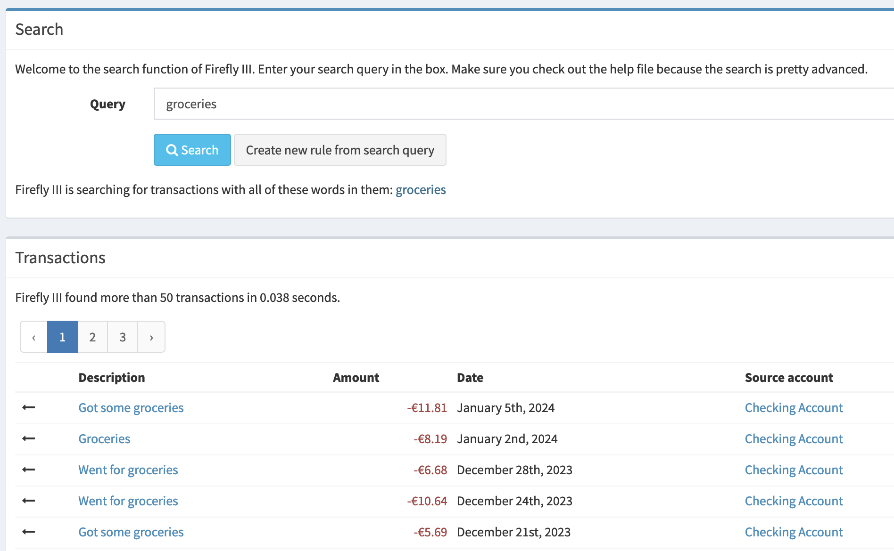
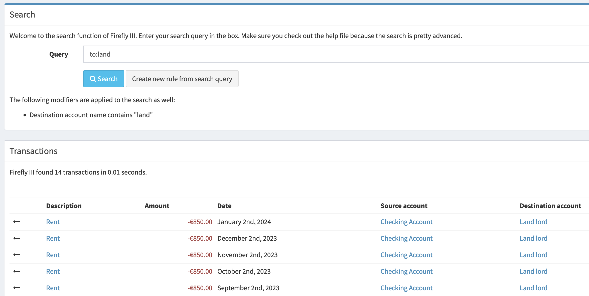
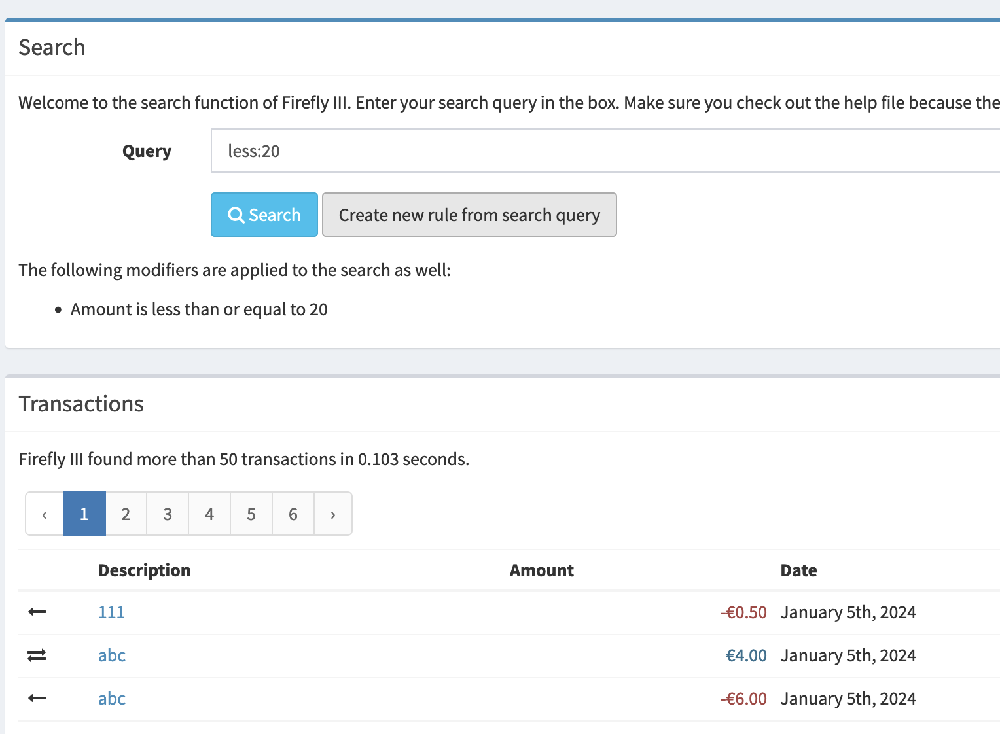
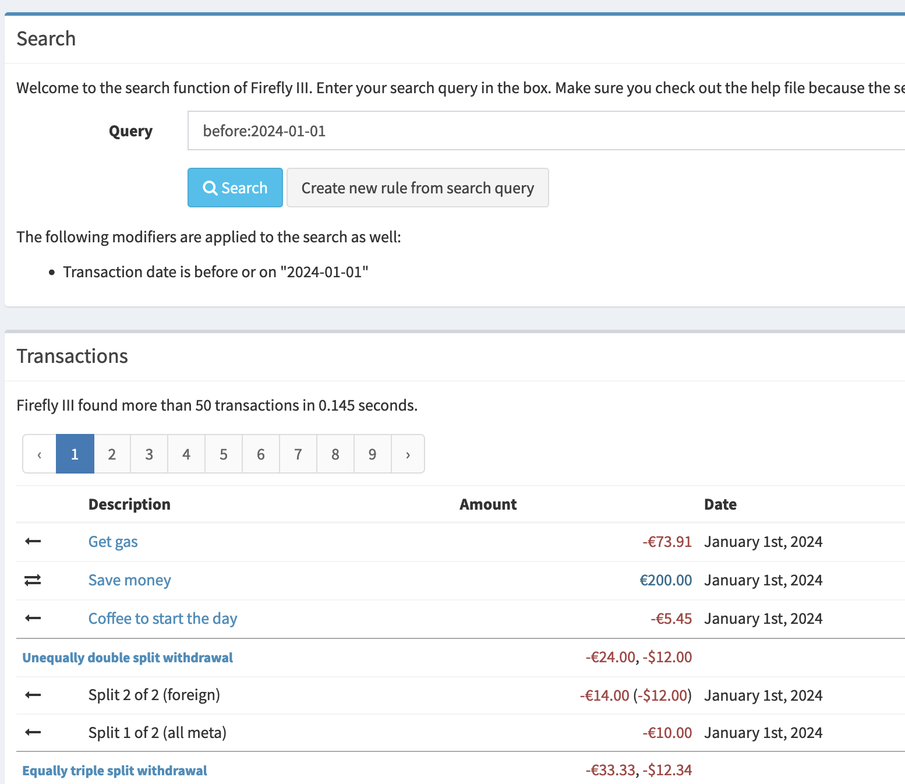

# How to use the search

You can search for transactions using the box in the left top of the page. The search engine is pretty powerful and can find almost anything, but it is not yet as user-friendly as it could be. My apologies in advance. 

## A basic search

Simply type in a word (or words), and Firefly III will search in the descriptions of transactions for what you're looking for.

Use `"a query with spaces"` if you need to search for things with spaces in them.

## Finding specific accounts

You can use `from:` and `to:` if you need to find transactions from or to a specific account. For example:

You can also search for amounts and dates. Here are two examples:

`less:20`

`before:2024-01-01`

## Combining search options

You can of course combine all of these options in any way you want.

## Which options are there?

Check out the [full reference to the search options](../../../references/firefly-iii/search.md).
