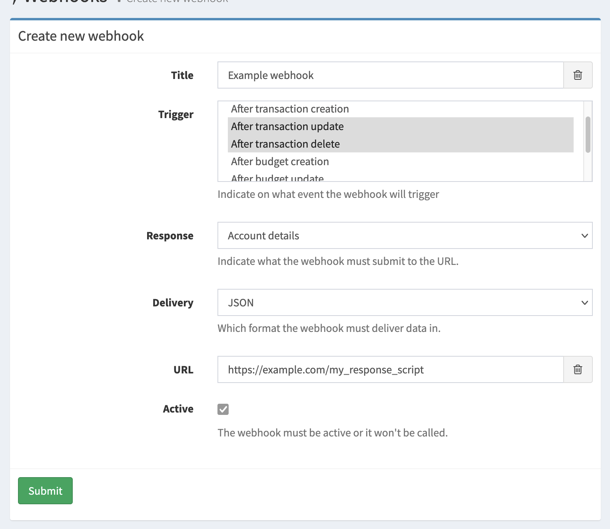

# Webhooks

A webhook is a custom callback. Triggered by events in Firefly III a message will be sent to a URL of your choice.

## Enable webhooks

Webhooks need to be enabled before they work. Set `ALLOW_WEBHOOKS=true`, either in your `.env` file or in your Docker environment variables.



## Triggers

There are a bunch of triggers for webhooks in Firefly III:

- When a transaction is created, updated or removed
- When a budget is created, updated or removed
- (some other trigger)
- When any of the above happens

A webhook can respond to multiple triggers. BUT, you cannot combine the  "After any event" with other triggers, it would have to be the only trigger. I hope this makes sense, because "After any event" already includes everything.

## Responses

When triggered, Firefly III will respond by sending a data package to the URL of your choice. The response can be configured, depending on the trigger.

A webhook can only send one thing. If you want multiple responses to be sent for the same webhook, you must set up multiple webhooks.

### Relevant details

If you select "Relevant details" as the response, Firefly III will send the relevant data for the trigger. This is up to Firefly III to decide. For example, if you trigger on a transaction creation, the response will be the transaction itself. If you trigger on a budget, the response will be the budget itself.

It is mandatory to select "Relevant details" when you select "After any event" as the trigger. This is because "After any event" can trigger on many different events, and Firefly III cannot know what you want to receive. Therefore, it will always send the relevant details for the event that triggered the webhook.

### Transaction details

You can choose to receive the transaction details for transaction related events.

### Account details

You can choose to receive the account details for account AND transaction related events.

## Delivery

All webhook responses will be delivered in JSON. This is the only option:

- JSON

## Create or edit webhooks using the API

You can manage webhooks using [the webhook API endpoints](https://api-docs.firefly-iii.org/#/webhooks) or on the page `/webhooks/index`.

## Webhook secret

Each webhook comes with a secret when created. The secret is used to generate the signature (see below). You can regenerate the secret, but you can't set a value yourself.

## Webhook limits

You must give webhooks a unique title.

It's not possible to send *two* or more responses *at the same time*, for example the transactions AND the accounts in response to ONE trigger. To do this, you must create two separate webhooks. These will have two separate secrets.

## Payload

When a webhook delivers its payload you can expect (more or less) the following result. The signature is important and explained later on.

### Headers

These are the headers Firefly III will include with each submitted webhook. The version will match your Firefly III version. The signature has been shortened for clarity.

```
User-Agent = FireflyIII/5.5.0
Signature = t=1610738765,v1=d62463af1dcdcc...
Accept = application/json
Content-Type = application/json
```

### Body

The body will be something like this.

The UUID is unique for each webhook message. You can use it for debug purposes. The user ID matches the user who created the webhook, and the trigger + response fields tell you why the webhook was fired and what the content of the `content` field is. The webhook message also contains the original URL of the webhook.

The `content` block corresponds to the `response` value. It's either the transaction, an array of accounts or something else entirely. This depends on the configuration of the webhook.

Note that the result sent to you by Firefly III isn't formatted as nicely. A webhook message from Firefly III isn't indented. Note also that in this example some parts of the actual `content` have been cut away to save space.

```json
{
	"uuid": "27db119a-c971-423f-9faf-cdae47367fc8",
	"user_id": 1,
	"trigger": "TRIGGER_STORE_TRANSACTION",
	"response": "RESPONSE_TRANSACTIONS",
	"url": "http:\/\/example.com\/",
	"version": "v1",
	"content": {
		"id": 246,
		"created_at": "2021-01-15T20:26:04+01:00",
		"updated_at": "2021-01-15T20:26:04+01:00",
		"user": 1,
		"group_title": null,
		"transactions": [{
			"user": 1,
			"transaction_journal_id": 251
		}],
		"links": [{
			"rel": "self",
			"uri": "\/transactions\/246"
		}]
	}
}
```


### Signature

This is a typical signature string:

```
t=1610738765,v1=d62463af1dcdcc7b5a2db6cf6b1e01d985c31685ee75d01a4f40754dbb4cf396
```

The signature comes in two parts, a timestamp (`t`) and a versioned signature hash (`v`). The timestamp is prefixed by `t=`. Each signature is prefixed by a scheme. Schemes start with `v`, followed by an integer. Currently, the only valid live signature scheme is `v1`. Therefore, the signature is prefixed by `v1=`.

The signature is generated using the HMAC method. The signed string is created by concatenating:

* The timestamp (as a string)
* The literal character `.` (a dot)
* The non formatted JSON body of the request.

Example: `123456.{"some":"json"}`.

The concatenated string is hashed using SHA-3 (256 bits). The shared secret key used for generating the HMAC key is the `secret` of the webhook itself.

A useful little script to verify webhooks [can be found on GitHub](https://gist.github.com/JC5/b8bedee09a7cb81f55e27149058e8c72).
