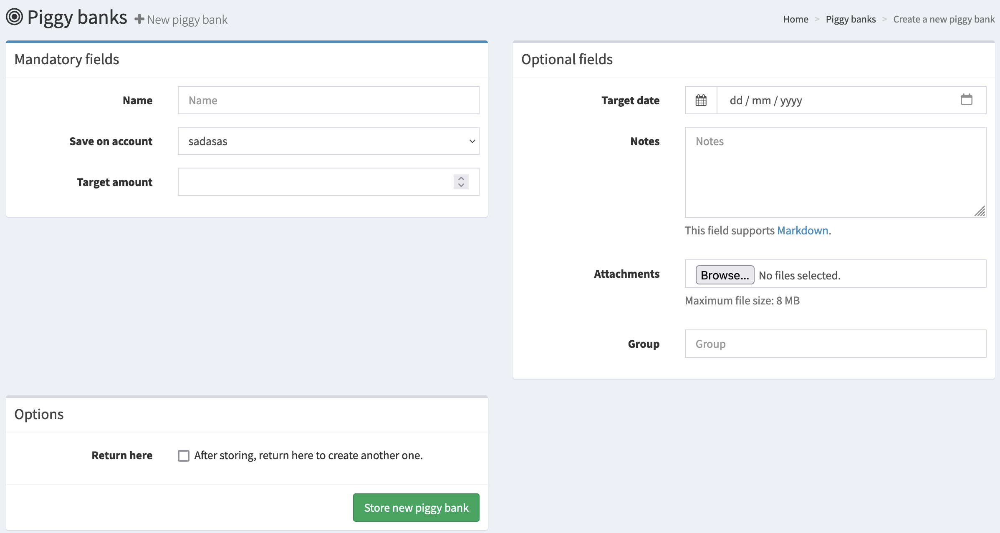

# How to use piggy banks

Firefly III features "piggy banks". Piggy banks are a way to divide a savings account in a number of parts, and divide the money among these parts. You can read more about them on the [page that explains piggy banks](../../../explanation/financial-concepts/piggy-banks.md).

Piggy banks can be managed from the `/piggy-banks` page on your installation.

## Create a piggy bank

It's always a good idea to keep piggy banks on a dedicated savings account. Let's assume you have one, with €500 on it. 

Click on "Create a new piggy bank" on the `/piggy-banks` page.

Enter some details for this piggy bank. The amount is not mandatory, but useful. Here's an example:

- Name: New camera
- Target amount: €300

You can save some notes (like a link to the camera webshop) and add attachments if you want to. Use the "group" field to group piggy banks together. This is useful if you have a lot of piggy banks.

## Manage the piggy banks

Here are three piggy banks I made:

I can use the \[+\] and \[-\] buttons to add or remove money from these piggy banks. That way I can divide the money on my savings account between the three goals I have.

On the bottom of the page, it shows you how much money you have left on your savings account. You can't add more money to your piggy banks than you have on your savings account.

## Adding money to or removing money from piggy banks

Apart from the \[+\] and \[-\] buttons, you can also link transfers to a piggy bank. The amount of the transaction will be automatically added to, or removed from the piggy bank.

When you create a transfer, select the piggy bank from the list!

### Behavior when piggy banks reach their maximum limit

When a piggy bank reaches its maximum limit, any additional funds from automated transfers will not be allocated to the piggy bank. The money will still be transferred to your account as usual, but won't be tracked within the piggy bank.

A warning will appear when a rule attempts to add money to a full piggy bank. You will need to monitor your piggy bank status yourself.

--- 

That's it! [Would you like to know more?](../../../explanation/financial-concepts/piggy-banks.md)
