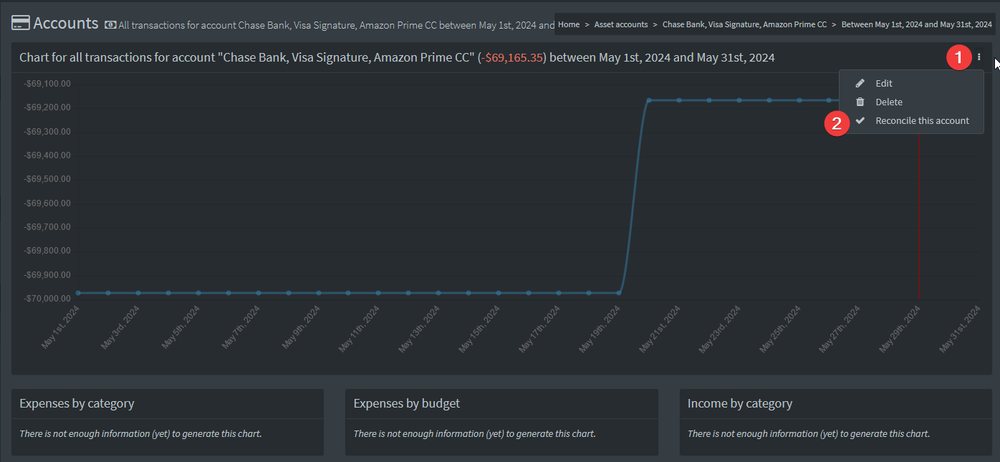

# How to reconcile accounts

Although more and more people use online banking, a lot of users still receive paper bank statements in the mail, every week or every month. Firefly III has a "reconciliation" view that allows you to verify that your transactions exactly match your bank statement. This can also help to resolve incorrect balances after importing a large set of transactions into Firefly III.

## Open the reconciliation page

Open the page from either the list of asset accounts, or from a single asset account page.

From a single account:

From the account overview:

## Start reconciling

First, enter a date range and set the opening and closing balance as it shows on your bank statement. 

For example:

* Start date: January 1st, 2018. Balance: € 120
* End date: January 31st, 2018. Balance: € 788

Next, press **Start reconciling** to continue.

Firefly III will show you the transactions from this range, plus a few earlier and later dated transactions. For each transaction line on your bank statement, find the matching transaction in Firefly III and check the box next to the amount column. Your goal is to verify that your Firefly III transactions exactly match your bank statement. Go over your entire statement and check each transaction in Firefly III.  

- If you find duplicate transactions, you can click on the transaction description to view the transaction, and from that page you can delete the transaction. After deletion, you will be returned to the reconcile page. Previously checked transactions will be checked again.
- If you find incorrect transactions, you can click the "edit" pencil icon, to go into edit mode. After edited, you will be returned to the reconcile view. Previously checked transactions will be checked again.

After you have matched all transactions, look at the amount at the top of the screen in the section labeled "Reconciliation options". 

### Amount under "Reconciliation options" is less than zero

This means that your Firefly III asset account has less money in it than it should have. Look for duplicate transactions or incorrect amounts and correct them as needed. When you press the "Store reconciliation" button you can let Firefly III create an automated transaction to correct this difference. 

### Amount under "Reconciliation options" is more than zero

This means that your Firefly III asset account has more money in it than it should have. Look for missing transactions or incorrect amounts and correct them as needed. When you press the "Store reconciliation" button you can let Firefly III create an automated transaction to correct this difference. 

### Amount under "Reconciliation options" is exactly zero!

Congrats! This means that your Firefly III transactions exactly match your bank statement. You can now press "Store reconciliation" to mark the checkmarked transactions as reconciled.

