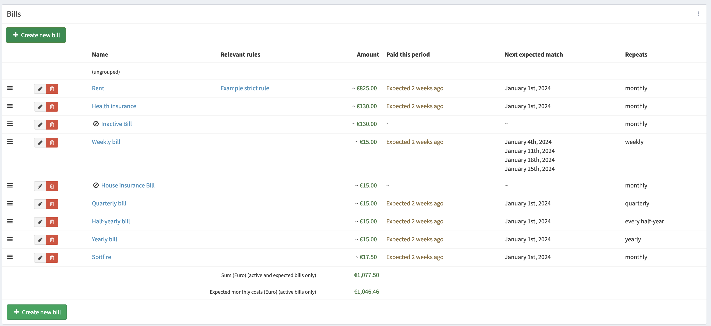
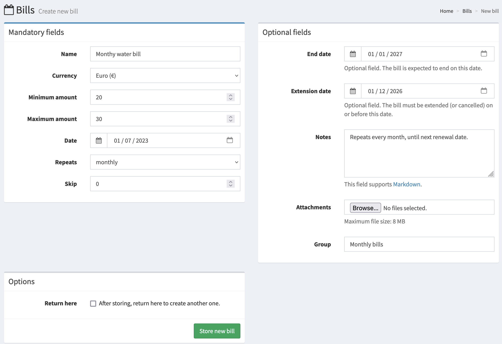
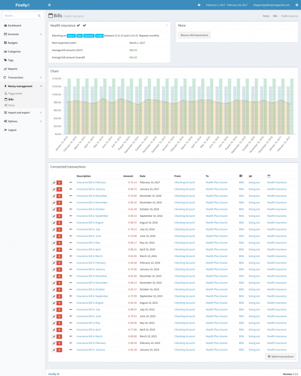

# How to use subscriptions?

In Firefly III a "subscription" is a record of a subscription or a recurring bill that you need to pay, like your rent or a Spotify subscription. You can read more about it in the [explanation about subscriptions](../../../explanation/financial-concepts/subscriptions.md).

You can create subscriptions for your common recurring expenses. You can use [rules](../features/rules.md) to automatically link transactions to subscriptions.

When you create a new subscription, Firefly III asks you for the minimum and maximum amount that you expect the subscription to be. This is important, because the average of these two amounts is used in charts and overviews.

## An overview of your subscriptions

On this screenshot you see the subscription overview from the demo site. You see that subscriptions can have a variety of periods, and that they can be active and inactive.

You'll also see that Firefly III tells you when to expect the subscription. 

The front page of Firefly III will also start showing the subscriptions. This box takes the average expected amount of the subscription (see ahead) and the amount already paid.

## Create a new subscription

When you create a subscription, you tell Firefly III the description and how often it repeats, etc., but also in what range you expect the subscription to be.

You can also set the end date and the extension date. If you know [how to set up a cron job](../advanced/cron.md), Firefly III can alert you about these dates. 

If you enter a number in the "skip" field, the subscription will be automatically skipped every X times; a subscription that arrives every 3 months can be entered by filling in "2".

The minimum and maximum amount and the period allow Firefly III to predict for you how much you should expect to spend on these subscriptions. On the frontpage, a little box will tell you how you're doing.  

After you create a subscription you are automatically redirected to the page to create a new rule. You can learn [how to manage rules](../features/rules.md). This new rule is autofilled to trigger on obvious things like the amount of the subscription and the description you entered. Fine-tune the rule so any new transactions will auto-match the rule. 

When you delete the subscription, transactions associated with the subscription will lose this association but will not be deleted.

### The date of a subscription

When you create a subscription you also have to fill in the (first) date you expect the subscription to hit. This date is purely cosmetic and will be used to inform you when the subscription can be expected. For example:

* A monthly subscription, on the 3rd day of the month, will hit: 3 Jan, 3 Feb, 3 Mar, etc.
* A weekly subscription, starting on 15 Jan, will hit: 15 Jan, 22 Jan, 29 Jan, 5 Feb, etc.

Keep in mind that weekly subscriptions may fall outside your expected range. At some point a weekly subscription will hit 5 times in one month.

## Subscription overview

Individual subscriptions will end up looking like this picture:

You see here the most important data of a bill, plus the transactions associated with a bill.
