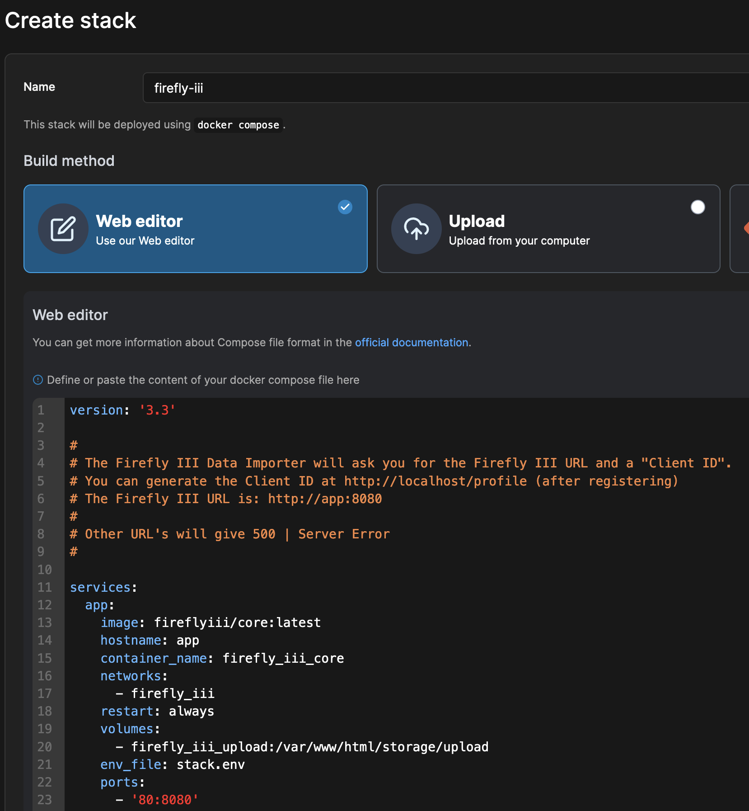
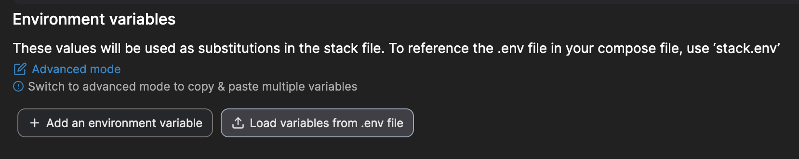
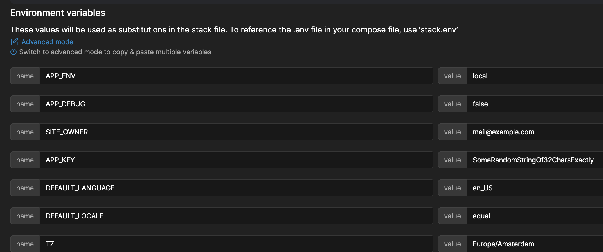
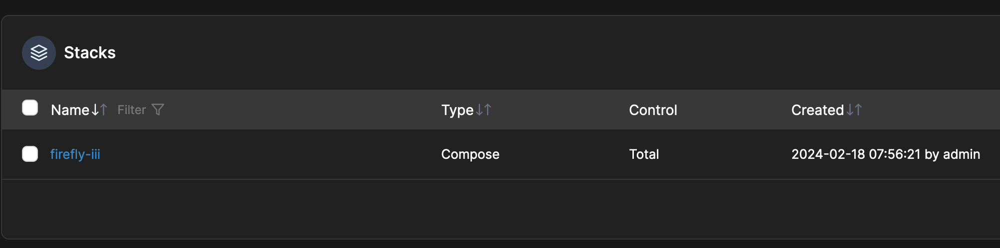
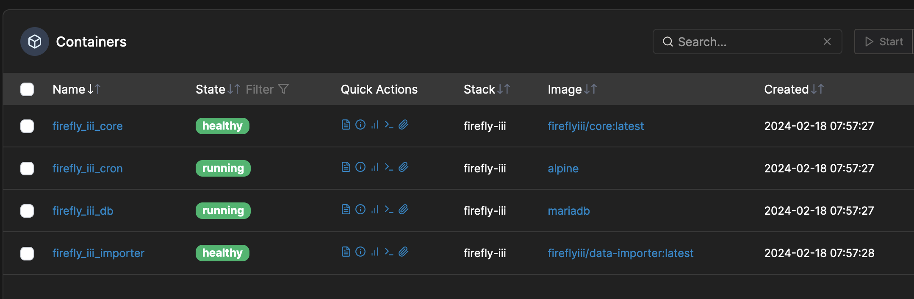

# Installation using Portainer

Portainer is a well known container management tool for Docker. It can help you manage your containers, networks and volumes.

You can add Firefly III and the Data Importer as a "stack" using the instructions below.

## Preparation

You will need to download and save the following configuration files:

1. [Docker compose](https://raw.githubusercontent.com/firefly-iii/docker/main/docker-compose-importer.yml) file
2. This [stack.env](https://support.firefly-iii.org/composed.php) file with all the environment variables. Save it as `stack.env`.

### Edit docker compose file

Open the docker compose file in your favorite editor, and change all references under `env_file:` to say `env_file: stack.env`.

!!! tip
All `env_file:` references must be pointing to exactly `stack.env`. Nothing else.

### Edit stack.env

You must do a few things:

1. Change `DB_PASSWORD` in `stack.env` to something else. Pick a nice password.
2. Also change `MYSQL_PASSWORD` in `stack.env` to the SAME value (it's at the bottom)
3. Change `FIREFLY_III_URL` in `stack.env` to `http://app:8080`
4. Change `VANITY_URL` in `stack.env` to `http://localhost`

## Installation

### Add docker compose file

Open Portainer and go to the environment where you want to install Firefly III. This is usually the "local" one. Then, select "Stacks" in the left-hand menu. Click "Add stack".

Give your stack the name `firefly-iii`, and copy-paste the content of your edited docker compose file.

### Add stack.env file

Upload the `stack.env` file here. You will see that Portainer will expand all the environment variables in the file.

If you did not make the changes indicated earlier, now is the time.

## Deploy!

Press the button to get the stack deployed! After a while, it should run as expected.

The default configuration will run Firefly III on port 80 which means you can visit Firefly III at [http://localhost](http://localhost). If your portainer is running somewhere else, or in a different configuration, the URL will be different of course.

The data importer (again, in the default configuration) can be reached at [http://localhost:81](http://localhost:81).

From this point forward, you can follow these tutorials and guides to help you set up:

- [Tutorial: Create accounts and transactions](../../../tutorials/finances/first-steps.md)
- [Tutorial: My first accounts](../../../tutorials/finances/first-accounts.md)
- [Tutorial: Import a basic CSV file](../../../tutorials/data-importer/csv.md)

