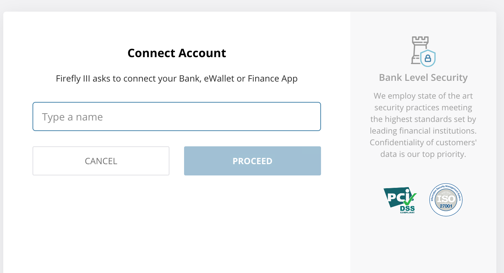
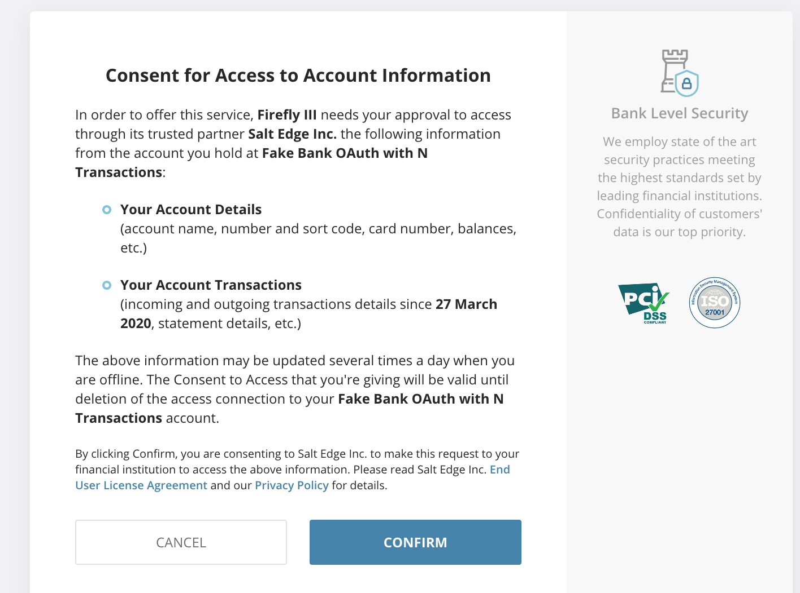
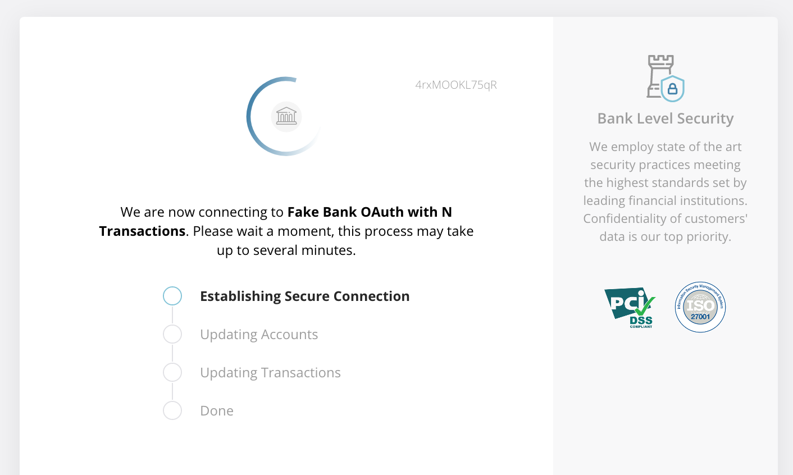

# Filter your import

The Spectre and YNAB importers have an extra option to filter the import.

## Spectre

The first thing you must do is create a new connection to your bank or select an existing one:

The **first time** you use the Spectre importer, you must create a new connection (duh).

In that case, you get redirected to the Spectre website where you can find your bank using the auto-complete dropdown:

If you can only find fake banks, you must first upgrade your Spectre account. By default, the Spectre API comes with fake data only. To get access to real life data you must upgrade your account by [contacting Spectre support](https://www.saltedge.com/clients/request_test_access). 

Spectre will ask for consent:

The connection will be made, after which you get sent back to the Firefly III Spectre importer:

Once back at the importer, the new connection is listed among your connections. Select it, and continue to the configuration.

## YNAB

You can create multiple budgets in YNAB. Each has a currency. You can import from multiple budgets. Select the correct budget to continue.