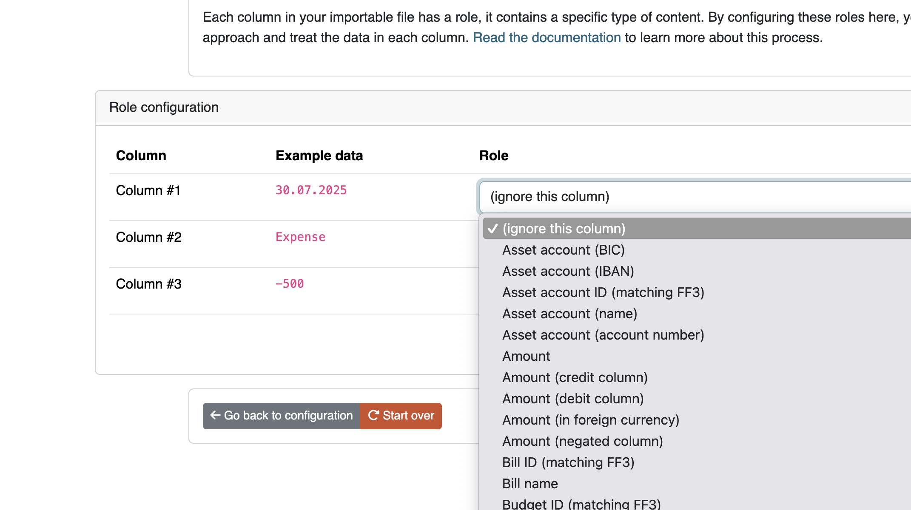

# Data field roles

The data importer can import a lot of data. This page lists all the roles that a column can have. You can use this page to validate your CSV file.

These options do not just apply to CSV files. Camt.053 files and Spectre and GoCardless imports also have roles assigned to their contents. For camt.053 there are less options for you to pick from per data field, since camt.053 standards are stricter. 

The roles for data importer from Spectre and GoCardless cannot be configured. Those are pre-set by the developer. 



## (ignore this column)

Select this role to ignore the content of the column.

## Date

This sets the main date of the transaction. This date will be used for sorting transactions. If your CSV file also includes a timestamp *in the same column* you can include it in your date format, and it'll be parsed as well.

It's important to be consistent about the date you use. Especially when your CSV has several date fields. Choose the date closest to the actual transaction.

Example data includes:

```text
2024-01-01
03/31/2024
2024-01-01 12:34:56
```

The data importer needs your help to convert this date. The content is parsed using a special format. Read more about the format in the [PHP documentation](https://www.php.net/manual/en/datetime.format.php).

Here are some examples:

* `Ymd`. Will convert `20210318`
* `F/j/Y`. Will convert `January/17/2021`
* `nl:d F Y`. Will convert Dutch date `5 mei 2021`


## Description

The description of the transaction. If you select multiple columns to be the description of the transaction, the columns will be concatenated together.

Example data includes:

```text
VB/000002628 INGDDEFFXXX DE94500105175185646536
Vishandel Hilvertshof HILVERSUM	Card 1234
```

## Asset account (\*)

These roles (\*several variations) are used to indicate the asset account in the transaction, usually your own. Think of these columns as the "payer" column, the person or account paying the money.

The "asset account" role and the "opposing account" role (see ahead) will be automatically switched by the data importer when the transaction is the other way around.

The variations for this field are as follows:

- IBAN: represents the IBAN of the asset account
- Number: represents the account number, for when your bank does not use the IBAN system.
- ID matching FF3: represents the ID of the asset account as it already exists in Firefly III. Banks don't generally know this ID, but you can map data to this value.
- Name: represents the name of the asset account as it is saved in Firefly III. Banks don't use this name, but you can map data to this value.
- BIC: represents the BIC value of this account

## Opposing account (\*)

These roles (\*in several variations) are used to indicate the opposing account. Usually these are stores or shops or opposing account details. Think of these columns as the "payee" column, the person or account receiving the money.

The "asset account" role and the "opposing account" role (see earlier) will be automatically switched by the data importer when the transaction is the other way around.

The variations for this field are as follows:

- IBAN: represents the IBAN of the opposing account
- Number: represents the account number, for when your bank does not use the IBAN system.
- ID matching FF3: represents the ID (see the URL) of the opposing account as it already exists in Firefly III. Banks don't generally know this ID, but you can map data to this value.
- Name: represents the name of the opposing account as it is saved in Firefly III. Banks don't use this name, but you can map data to this value.
- BIC: represents the BIC value of this opposing account

## Amount

Indicates the amount of the transaction. Most of the time, the amount is stored both positive and negative. The data importer can handle this automatically. Use "Amount (negated column)" if the transactions get imported the wrong way around.

Example data includes:

```csv
12.34
-56.78
99.99
```

## Amount (in foreign currency)

Indicates the foreign amount of the transaction. If you select a column that contains the foreign amount, you must also select the "Foreign currency code (ISO 4217)" role. Otherwise, it may not be possible to import a foreign amount.

## Amount (credit / debit column)

Some banks split the amount in two columns. One for debits, one for credits. Use this column type for either field. This is relevant when you see TWO columns with amount data in your CSV file.

```csv
description,debit,credit
You buy groceries,12.34,
You get a refund,,12.34
```

## Bank specific credit/debit indicator

Some banks use a column with a magic letter or word to indicate if the transaction is an expense or income. The data importer has a role for such columns, and [most letters are recognized](https://github.com/firefly-iii/data-importer/blob/main/app/Services/CSV/Converter/BankDebitCredit.php#L51).

This is useful when your data is something like this:

```csv
12.34;CR;
56.78;DB;
```

## Subscription

Use this field to link the transaction to the right subscription. You can use the subscription name or the subscription ID. Few banks deliver enough data to deduce the Firefly III subscription, so this field is not used often by users. However, if your bank happens to classify transactions for you, you may be able to use it.

- Subscription name: expects the content of the field to be the literal subscription name in Firefly III
- Subscription ID: expects the content of the field to be the literal subscription ID (see the URL) in Firefly III

The content of this field can be mapped, so "SOMEVAL" can be mapped to "Some Value" in Firefly III.

## Budget

Use this field to link the transaction to the right budget. Few banks deliver enough data to deduce the Firefly III budget, so this field is not used often by users. However, if your bank happens to classify transactions for you, you may be able to use it.

- Budget name: expects the content of the field to be the literal budget name in Firefly III
- Budget ID: expects the content of the field to be the literal budget ID (see the URL) in Firefly III

- The content of this field can be mapped, so "SOMEVAL" can be mapped to "Some Value" in Firefly III.

## Category

Use this field to link the transaction to the right category. Although few banks actually do this, some banks give your transactions categories, if only what type of expense (like wether it was by card, check or touchless payment). The content of this field can be mapped, so "SOMEVAL" can be mapped to "Some Value" in Firefly III.

## Currency code / name / symbol

Use this field to set the currency of the transaction. The currency ID must match the Firefly III currency IDs. This is never the case of course.

The content of this field can be mapped, so "E" can be mapped to "Euro" in Firefly III.

## Foreign currency code (ISO 4217)

Use this field to set the currency code of the foreign amount of the transaction. This works the same as the normal currency fields.

## Meta date fields

Consists of:

- Interest calculation date
- Transaction booking date
- Transaction process date
- Transaction due date
- Transaction payment date
- Transaction invoice date

These are meta-dates related to the transaction you can set. Import these dates so data isn't lost. Most people use the date that is closest to the actual transaction date as the main date (see earlier in the text about the "date" field). The other dates can be stored pretty much as you wish. When reconciling transactions it might be useful to select the processing date of the bank as the date.

If you are importing, always make sure you have at least one "Transaction date" field configured, or your transactions will not be imported with the correct date.

## External ID / Internal reference

Some banks give transactions their own ID's. Often, you can find these values in the first column of your CSV file. If you are reasonably sure this number is unique, store it in either the external ID or internal reference field (this is up to you). Firefly III can use these values to check for duplicates.

## Tags

The Firefly III can import space and comma separated tags. This can be useful when your bank submits automated tags with your transactions. The tags will be split and stored in Firefly III.

## Note(s)

Any notes you wish to import. If you select multiple columns to be stored in the notes field, they will be concatenated together. It's not that column A will override column B, for example.

Multilines notes spanning to more than one line can be imported, just remember to close quotes correctly and to use [Markdown format](https://www.markdownguide.org/basic-syntax/#line-breaks):

> ```
> "this","is my","csv line","with my notes: to add a newline, finish a sentence with two spaces  
> and continue on the next line
> 
> or give a double enter"
> ```

In Firefly III you'll see the notes this way:


## SEPA fields

The Firefly III CSV importer can import several [SEPA](https://en.wikipedia.org/wiki/Single_Euro_Payments_Area) related fields. As a rule, these are read-only after importing.

- SEPA end-to-end Identifier
- SEPA Opposing Account Identifier
- SEPA Mandate Identifier
- SEPA Clearing Code
- SEPA Creditor Identifier
- SEPA External Purpose
- SEPA Country Code
- SEPA Batch ID

## Other leftover fields

Many CSV files contain extra data. Things like zip codes, retention policies or other data that doesn't really fit in Firefly III can be stored in the "notes"-field. This doesn't make the data more easily accessible but at least it'll be saved.
