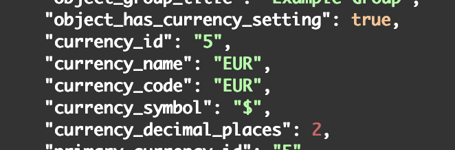
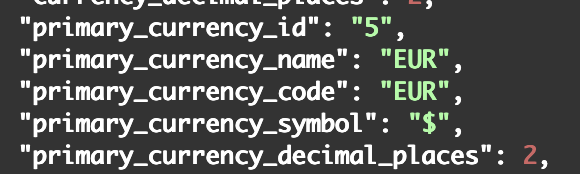
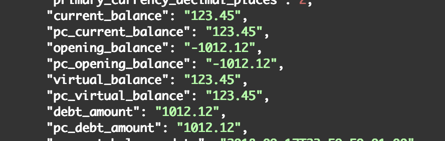

# API

See also:

- [How to talk to the API](../../../how-to/firefly-iii/features/api.md)

Firefly III features a JSON API.

Please visit the [dedicated Swagger documentation](https://api-docs.firefly-iii.org/) where you can read and try the API. [A PHP library](https://github.com/StanSoftBG/oauth2-firefly-iii) was developed by [StanSoft.BG Ltd.](https://github.com/StanSoftBG) that you can use to talk to Firefly III in PHP.

The API is slated to become the only way to talk to Firefly III: even the UI would use the API exclusively. Alas, this is a work in progress.

## Currencies in the API

All objects where currency is relevant have `currency_*` attributes. They refer to the currency set in the object. Most objects (accounts, transactions, etc.) carry their own currency settings. For example, a bill or a piggy bank has its own currency, regardless of the primary currency of the administration. Expect something like this:

Also visible is the `object_has_currency_setting` setting which confirms this particular object has its own currency setting. This is true for most objects, such as accounts, transactions, bills, budgets, etc. However, some objects do not have their own currency setting, such as categories or tags. In those cases, the `object_has_currency_setting` will be `false`.

All objects where currency is relevant have `primary_currency_*` attributes. These refer to the primary currency of the financial administration. They may be different from the currency set in the object. For example, a transaction may be in USD, but the primary currency is EUR. This is important for conversions and exchange rates.

Amounts, balances and collections of expenses (such as `spent` or `earned` arrays) will always be in the currency of the associated object. For example, a transaction in USD will have amounts in USD, even when the primary currency is EUR. The API also returns all of these fields as `pc_*` attributes. These are the "converted to **p**rimary **c**urrency" attributes. If the user enables "convert to primary", these fields will contain the amounts converted to the primary currency of the financial administration, using the exchange rate set in Firefly III.

If the user does NOT enable "convert to primary", all `pc_*` attributes will be `null`. This means that the API will not convert amounts to the primary currency. If the currency of the object is the same as the primary currency, the `pc_*` attributes will be the same as the regular attributes. For example, a transaction in EUR with a primary currency of EUR will have `amount` and `pc_amount` set to the same value.

## Configuration values

The endpoint `/api/v1/configuration` returns a variety of static and dynamic configuration values of Firefly III.

There are two sets of configuration values that you can retrieve through this endpoint.

1. Static values. You cannot edit these. The source code of Firefly III has [the full list of options](https://github.com/firefly-iii/firefly-iii/blob/main/app/Support/Binder/EitherConfigKey.php#L35).
2. Dynamic values. These can be changed. The source code of Firefly III has [the full list of options](https://github.com/firefly-iii/firefly-iii/blob/main/app/Support/Binder/DynamicConfigKey.php#L35).
