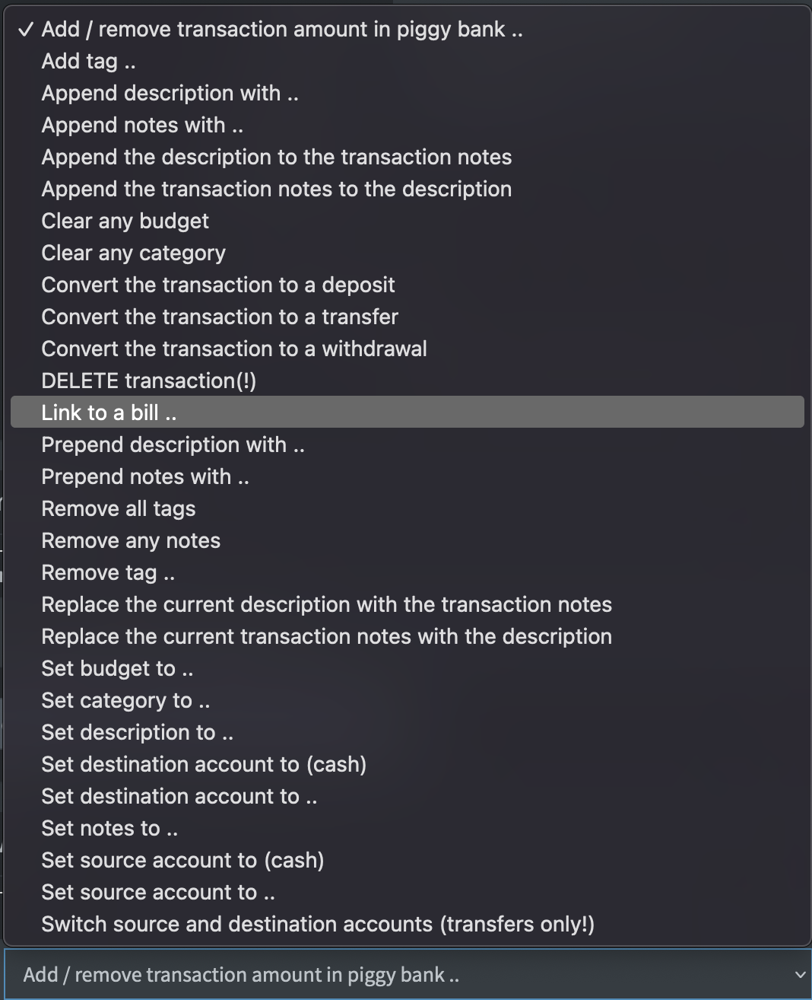

# Rule actions

Rules, [once triggered](rule-triggers.md) can do a bunch of stuff to your transactions. Make sure to also read [how to use rules](../../how-to/firefly-iii/features/rules.md). Here are all rule actions. You can see the full list in Firefly III:

Here's a summary of the rule actions you can use. 

## Set meta data

Set the category, budget or tag(s). Link to a subscription or a piggy bank.

## Clear meta data

Clear the category, budget, all tags or a specific tag.

## Description and notes

Set the description, or set notes. Append to the description or prepend to the description or notes. Also possible: swap notes and description, copy or move the notes and the description (and vice versa). You can also clear the notes entirely

## Accounts

Set the source or destination account. Swap the source and destination account. Set the source or destination to the cash account.

## Delete transaction

If you use this action, the transaction will be deleted. There is no undo.

## Converting to another transaction type

If you set an action to convert your transaction to a deposit, a transfer or a withdrawal, configure the rule action correctly. If you don't do this right the rule action wil *silently* fail and nothing will happen. Here you can read what will happen to your transaction. This is dependent on the original type and the future type of the transaction.

These conversions will *not* be applied to split transactions.

### From a deposit to a withdrawal

The money will be transferred away from the asset account instead of deposited into it. The "action value" you must provide must be the name of a valid destination expense account. If it does not exist, it will be created.

If you leave the action value blank, the new expense account will be named after the revenue account. So, a deposit from "Your Boss" becomes a withdrawal at "Your Boss".

### From a transfer to a withdrawal

Firefly III will replace the destination asset account with an expense account. So, a transfer from your Checking Account to your Savings Account will be converted into a withdrawal from your Checkings Account to destination Account X, where X is an expense account. The "action value" you must provide must be the name of a valid destination expense account. If it does not exist, it will be created.

If you leave the action value blank, the new expense account will be named after the original destination asset account.

### From a withdrawal to a deposit

The money will be deposited into the asset account instead of withdrawn from it. The "action value" you must provide must be the name of a valid source revenue account. If it does not exist, it will be created.

If you leave the action value blank, the new revenue account will be named after the original expense account. So, a withdrawal from "Walmart" becomes a deposit from "Walmart".

### From a transfer to a deposit

Firefly III will replace the "source" asset account with a revenue account. So, a transfer from your Savings Account to your Checking Account will be converted into a deposit into your Checkings Account from source Account X, where X is a revenue account. The "action value" you must provide must be the name of a valid revenue account. If it does not exist, it will be created.

If you leave the action value blank, the new revenue account will be named after the original source asset account.

### From a withdrawal to a transfer

The money will be moved away from the original asset account, into another asset account. The "action value" you must provide must be the name of a valid destination asset account. If it does not exist, the action will fail.

If you leave the action value empty, the action will fail.

### From a deposit to a transfer

The money will be moved into the original asset account, from another asset account. The "action value" you must provide must be the name of a valid source asset account. If it does not exist, the action will fail.

If you leave the action value empty, the action will fail.
