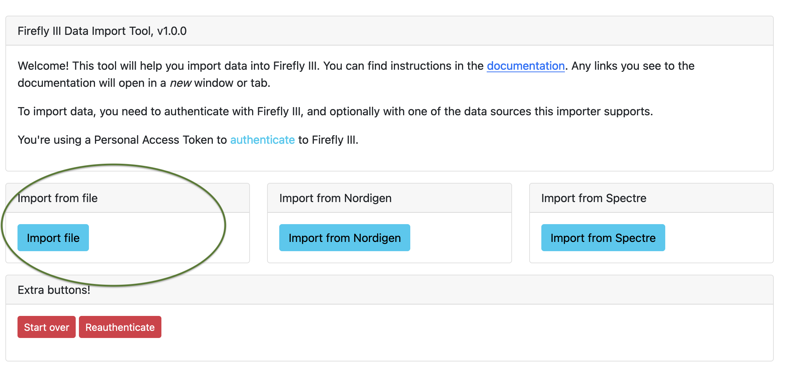

# Import a basic CSV file

!!! tip
    I've not yet finished writing this tutorial. Some items may not be filled in yet. I apologize for the inconvenience. Please refer to the [support page](../../explanation/support.md) if you have questions.

## Select a data source

- Link to how to install the data importer

Browse to importer, select CSV, upload a CSV file.

## Import a CSV file or a camt.053 file

You have to upload the file you wish to import. 

!!! info "A note when importing CSV files"
    If the file contains any lines before the data starts, you must remove them manually. If there are extra headers (for example every 100 rows) you'll have to delete those too.

There may be a standard configuration file for your bank in **[this GitHub repository](https://github.com/firefly-iii/import-configurations)**. If not, it is OK to continue without a configuration file.

## Configure the import

The options on this page are explained on the page [how to import a file](../../how-to/data-importer/import/file.md). The most important options are:

- The delimiter (comma's, semicolons or something else)
- Headers, yes or no?

### Duplicate transaction detection

For now, select "content-based duplicate detection". You can learn [how duplicate detection works](../../how-to/data-importer/import/duplicates.md).

## Column roles

You have to tell the Firefly III data importer what each column means. The page looks something like this:

Each column must be given a role. You can of course, choose to ignore a column. These are the roles that you can choose from:

## Map data

If you import data, you can "map" the data found to data already present in Firefly III. You can use this to map account names in the CSV or camt.053 file to account names already in Firefly III. If you do not map data, Firefly III will make one-on-one to existing or to be created data.

To read more about this, read the [how to map data](../../how-to/data-importer/import/map-data.md).

## Import

The import process consists of two steps. First a conversion and data validation. Then, the data will actually be sent to Firefly III.

Press "Start Job" to start the conversion and validation process. If this is successful, you can press "Start Job" after a few moments to import the data.

Each step can run into plenty of errors. Most of them are documented in [this FAQ](../../references/faq/data-importer/import.md), but I'm pretty sure I missed a few. Please refer to the [support page](../../explanation/support.md) if you need help.
