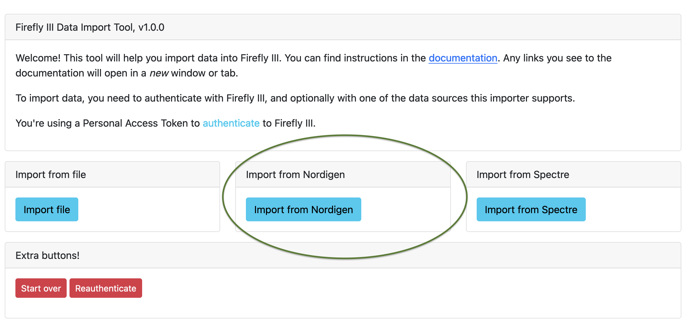

# Import from GoCardless

!!! note
    GoCardless is "shifting away" from their Bank Account Data products (aka the service you need for this to work). These instructions are only here for users who still have access to their GoCardless account.

## Select GoCardless

My apologies, in this screenshot it is still called "Nordigen".

## Import from GoCardless

If you import from GoCardless, you can also optionally upload a GoCardless configuration file. Also, you may have to enter your GoCardless ID and GoCardless Key, if they are not part of the data importer's environment variables.

Read the page about [the data importer](../../explanation/data-importer/introduction.md) for more information about GoCardless.

After these settings, you must select your country and your bank of choice.

If you continue, you will end up at the configuration screen.

# Configure the import

After uploading a file, you'll be presented with a list of options. Some options are specific to a way of importing, like CSV or camt.053 files, GoCardless or Spectre. We start from the top and go down the page.

## GoCardless import options

For GoCardless you must first select the accounts to import from, and indicate in which account the data must be imported.

Your selection may be limited: if the IBAN matches you have no choice. If the currency matches, only accounts with that currency can be selected.

## Import options

### Default import account

Select the asset account you want to link transactions to, if your import doesn't have enough meta-data to determine this. This is some time useful when files just list the transactions and the destination, nothing more.

### Rules

Select this if you want Firefly III to apply your rules to the import. It is useful to run your rules after the import, so the transactions are cleaned up.

### Import tag

When you check this the data importer will add a tag to each imported transaction denoting the import; this groups your import under a tag.

!!! note "Rules"
    If you have rules that remove all tags from a transaction, they will *not* work when you use this option. The tag will always be added. This is not because the data importer uses some magic trick. The tag is added *after* the transaction is created.

### Custom import tag

You can set a custom import tag if you do not like the default one. To learn more about the possibilities, read the [FAQ on custom import tags](../../how-to/data-importer/advanced/custom-import-tag.md).

### Date range

For GoCardless imports, you can select a date range, limiting the import. Options are as follows:

- Import everything.
- Go back a number of days, weeks, months or years.
- Select a specific range to import from.

## Duplicate transaction detection

Checkout the [FAQ on duplicate transactions](../../how-to/data-importer/import/duplicates.md) and the FAQ on re-importing transactions for more information.

!!! info "Duplicate detection"
    If you're unsure about what setting to use, use content-based duplicate detection.

## Other options

If you want to, check the "skip form" button, so you don't have to go through these options each time you start an import.

