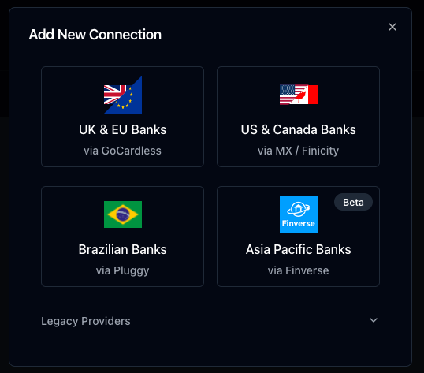
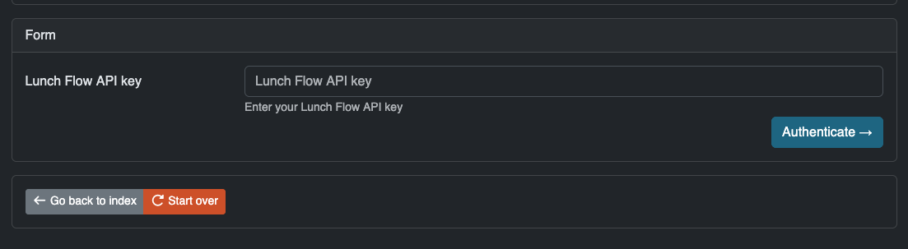
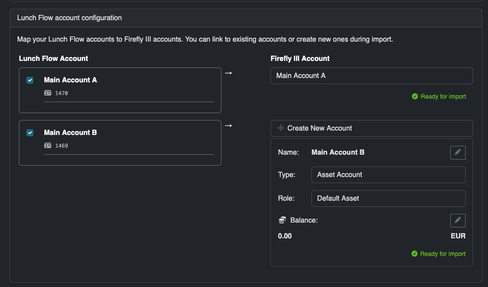
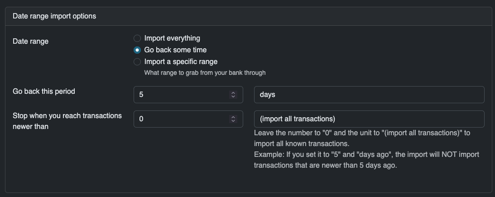
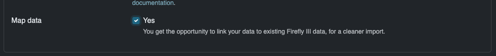
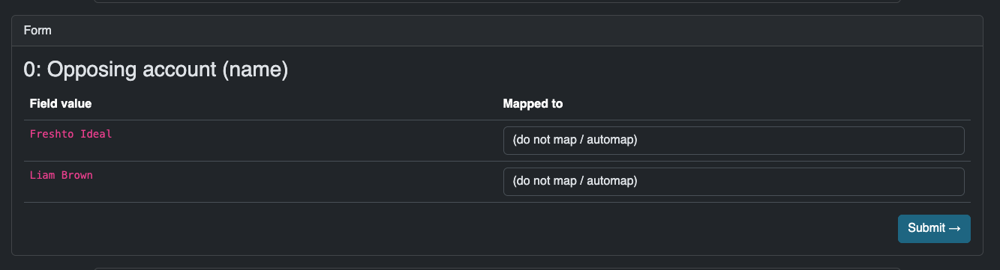
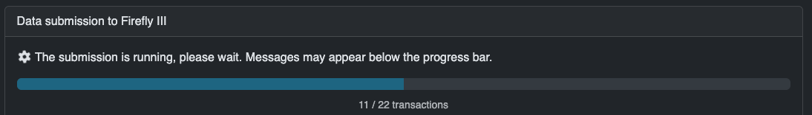

# Lunch Flow

[Lunch Flow](https://www.lunchflow.app/) is a paid provider that can connect to many banks through a bunch of APIs they maintain. This tutorial assumes you have signed up etc.

## Create a connection

In your dashboard, under "Connections", click "New Connection" and follow the instruction to connect to your bank. You can repeat this process for multiple banks if you want.



### Customize the connection

On the page of your new connection, open the dropdown that says "X Accounts". Under the tabs "Details", "Payee", "Notes" and "Balances" you can set various options that will reflect in Firefly III. Adjust them to your liking, but make sure that the "Notes" value contains something. I suggest "Remittance Information Unstructured".

!!! note
    The "Notes" field ends up in the transaction description in Firefly III, and if you leave it empty, all transactions end up as "(no description)", which is not very useful.


## Create an API key

Next, go to "Destinations" and click "Add Destination". Select "API" as the destination type. Give your new destination the name "Firefly III".

Once created, click Configure on the created destination. You need the "API Key". Copy it using the button.


## Configure the data importer

In order to make the data importer work with Lunch Flow you can do two things.

### Set the API key as an environment variable

Set the following environment variable. It depends a little bit on how you run the data importer how you must do this. You may have to edit `.importer.env` or set it in your Docker configuration.

```
LUNCH_FLOW_API_KEY=your_api_key_here
```

### Enter the API key in the UI

If you open the data importer and select Lunch Flow as the import method, you can enter the API key in the UI. This works but is not recommended, because you have to enter it every time.



## Upload a configuration file

Since this is the first time you're connected to Lunch Flow, you can skip this step.

## Configure the import

The import can be fine-tuned. Most options are self-explanatory. Some are special:

### Select accounts

On the Configuration page, you can select which accounts to import from, and into which Firefly III account the data must be imported. You can also tell the data importer to create new asset accounts, if they are not yet present.



### Date range 

You can tell the data importer to go back only a limited period of time. This is useful if you have already imported data before, and only want to import recent data.



### Map data to Firefly III data

Optionally, select this option to map data to Firefly III data. What this does is explained in the next step.



Finally, press "Submit ->" to continue.

## Converting data

This step will convert Lunch Flow data to Firefly III data. It will take a moment to run. Press "Start Job ->" and wait.


## Map data to existing accounts

The data importer can connect the destinations of your expenses (or the source of income) to accounts in Firefly III. This is useful when you already have account data present in Firefly III, and doubly so when you have a savings account you want to be linked correctly.



What you see here:

1. The "Opposing account (name)" is Firefly III's name for the merchant, the payee or the other party in a transaction.
2. In the "Field value" below, you see all possible names Firefly III has found during the import.
3. In the "Mapped to" drop down, you can select which Firefly III account this opposing account must be linked to.

If you select nothing, which is the default option, Firefly III will create a new account for this opposing account or find an existing one to use.

Press "Submit ->" to continue.

## Submit to Firefly III

Finally, you can submit the data to Firefly III. Press "Start Job ->" to continue.



Once this process is complete, the data is imported. You can save the configuration file for later use. Congrats!

