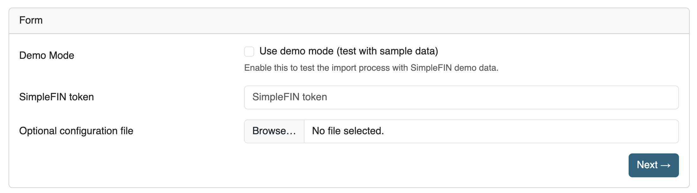

# SimpleFIN imports using the data importer

## Introduction

SimpleFIN is a service that allows you to import financial data from various banks into Firefly III. You can read more about SimpleFIN on their [website](https://www.simplefin.org/).

## Configuring the importer

In the UI, enter the connection details from your bank. If you have set the necessary environment variables, the data importer will automatically use these values. If you have not set the environment variables, the data importer will ask you for the connection details.

Environment variables are set in the `.env` file, or as Docker environment variables. The data importer will use the following environment variables:

* `SIMPLEFIN_TOKEN`: Your SimpleFIN API token.
* `SIMPLEFIN_CORS_ORIGIN_URL`. The URL of your Firefly III data importer instance.

## Select the accounts

Select the accounts you wish to import data from. If they do not exist yet, you can have them created for you.

## Configure the import

Any other options can be set at your leisure.

## Import the data

You can click through the rest of the import process. The data importer will process your data and import it into Firefly III.