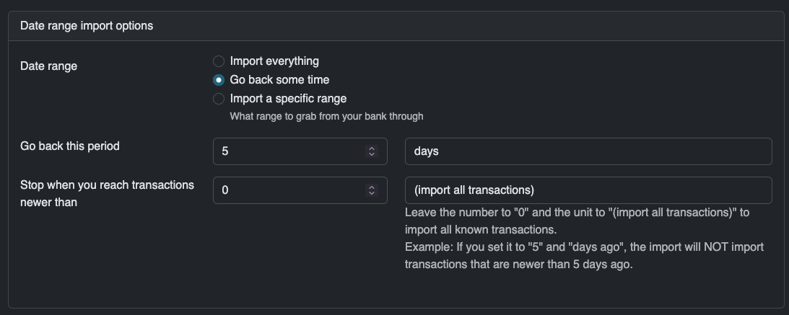
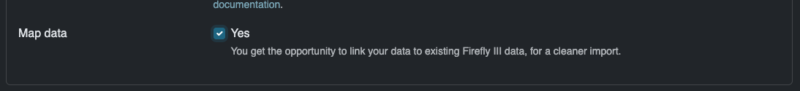
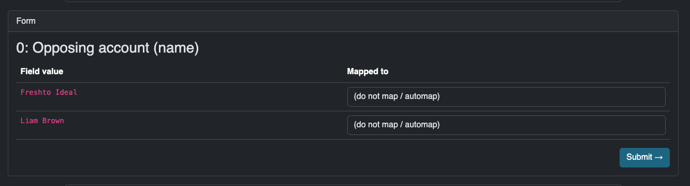

# Sophtron

Sophtron is a platform that offers (among many other things) a collection of financial data aggregation APIs, that connect you to a large collection of US, Canadian and Mexican banks. Sophtron is free for individual developers and personal use, as is detailed in their [developer agreement](https://sophtron.com/developerAgreement). The Sophtron API is available to you free of charge for personal, non-commercial use under this agreement. Although there are no usage limitations, a fair use policy is implemented.

## Registration at Sophtron

To use Sophtron, register a new account [on their website](https://sophtron.com/account/register). Make sure you read and understand their user / developer agreement.

## Collect access key and user ID

Once registered and logged in, go to [your API settings](https://sophtron.com/manage/developer) and write down or copy/paste your User ID and Access Key:

## Register your bank

Surf to the [widget demo](https://sophtron.com/widgets-demo) and find your financial institution. Use the auto-complete box to find it. In the example in the screenshots ahead, I am connecting to the "test"-bank of Sophtron.

Proceed with the registration and follow the instructions. This is different for each bank.

## Connect the dots in the Firefly III data importer

You can do two things.

1. Enter your User ID and Access Key as environment variables: `SOPHTRON_USER_ID` and `SOPHTRON_ACCESS_KEY`. You can find them in your `.env` file, or add them to your Docker configuration.
2. You can enter them manually when you click Sophotron in the next step.

Either way, when you click "Sophtron" on the home page of the Firefly III data importer, you should either get the question about your User ID and Access Key, or you can continue to the upload.

### Upload a configuration file

If you have a configuration file you can upload it now. If you have no idea what it is, just press Next.

### Select the bank accounts to import from

After some reloading, the data importer will show you the configuration screen. The import can be fine-tuned. Most options are self-explanatory. Some are special:

### Select accounts

On the Configuration page, you can select which accounts to import from, and into which Firefly III account the data must be imported. You can also tell the data importer to create new asset accounts, if they are not yet present.

### Date range

You can tell the data importer to go back only a limited period of time. This is useful if you have already imported data before, and only want to import recent data.

### Map data to Firefly III data

Optionally, select this option to map data to Firefly III data. What this does is explained in the next step.

Finally, press "Submit ->" to continue.

## Converting data

This step will convert Sophtron data to Firefly III data. It will take a moment to run. Press "Start Job ->" and wait.

## Map data to existing accounts

The data importer can connect the destinations of your expenses (or the source of income) to accounts in Firefly III. This is useful when you already have account data present in Firefly III, and doubly so when you have a savings account you want to be linked correctly.

What you see here:

1. The "Opposing account (name)" is Firefly III's name for the merchant, the payee or the other party in a transaction.
2. In the "Field value" below, you see all possible names Firefly III has found during the import.
3. In the "Mapped to" drop down, you can select which Firefly III account this opposing account must be linked to.

If you select nothing, which is the default option, Firefly III will create a new account for this opposing account or find an existing one to use.

Press "Submit ->" to continue.

## Submit to Firefly III

Finally, you can submit the data to Firefly III. Press "Start Job ->" to continue.

Once this process is complete, the data is imported. You can save the configuration file for later use. Congrats!