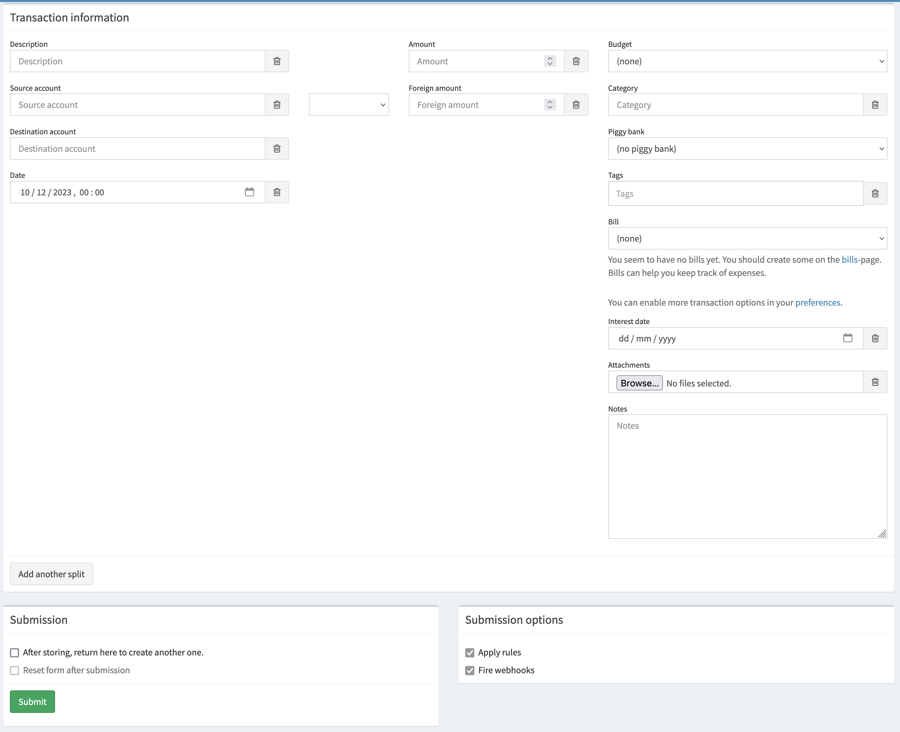
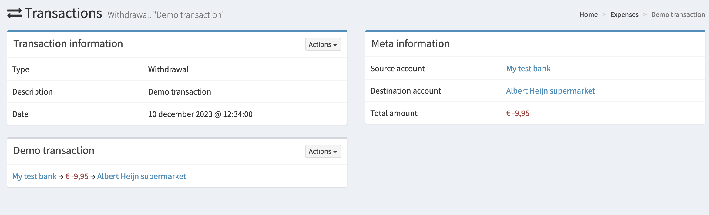

# Create accounts and transactions

Let's assume you managed to install Firefly III using the [how-to guides](../../how-to/index.md)

This tutorial assumes you already registered yourself, as it is explained in the [how-to guides](../../how-to/index.md), and expands upon ["my first accounts"](first-steps.md) tutorial.

## Create a transaction

Let's create our first transaction. Use your bank statements to find out which transactions we can create. Since we entered yesterday's balance in the account form,
it's best to recreate yesterday's transactions by hand. We can look into importing data later.

Click the PLUS button in the top right corner next to your email address. Then click "New withdrawal". You will see this screen:

There are a lot of options to fill in, but we're going to stick to the basics for now.

1. Under "Description", fill what the transaction was for. Example: "Groceries", "this month's rent" or "present for my mom".
2. Under "Source account", use the keyboard to type your bank account name and select your main bank account from the list.
3. Under "Destination account", type the name of the store where the transaction took place. For example: "Walmart", "Amazon" or "MacDonalds".

Under date, you select yesterday's date using the dropdown. You can also enter the time if you wish.

Under amount, you enter the amount. The amount must always be positive, even though this is a withdrawal.

We won't use the other fields for now. Scroll down if necessary and press "Submit".

## Check the transaction

You can find the transaction on your home screen on the right, or by browsing to Transactions > Withdrawals.

## Create more transactions

Just keep pressing that \(+\) button to create more transactions. Keep the following rules in mind.

1. New deposits need a new source account, the "[revenue account](../../references/firefly-iii/account-types.md)". To create it, just type the source of the money in the Source Account field. The account will be automatically created. For example, just type "My job" and the account will be created. The destination account must be your main asset account.
2. Transfers between accounts can be recorded by making the source AND destination accounts point to one of your asset accounts.

You are free to add tags or set a category, but bills, budgets and piggy banks need more work. We'll get to that later.

## Validate balance

Browse to Accounts > Asset accounts. Here you should see your bank accounts and some extra's, with the correct balance.

## Would you like to know more?

- [How to organize transactions](../../how-to/firefly-iii/finances/transactions.md)
- [How to manage budgets](../../how-to/firefly-iii/finances/budgets.md)
- [More how to guides](../../how-to/index.md)
