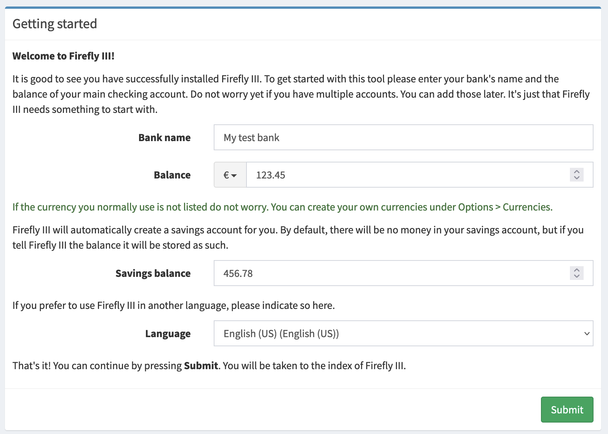
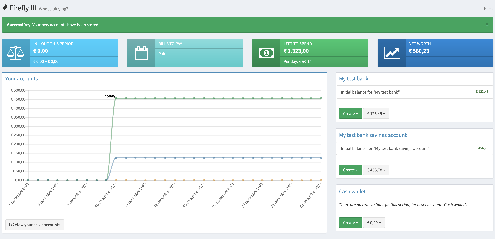

# My first accounts

Let's assume you managed to install Firefly III using the [how-to guides](../../how-to/index.md). You've got a working installation, and you're ready to go. What's next?

In this tutorial you will learn how to set up your first accounts, so they match your bank statements. You will also learn how to create some transactions.

This tutorial assumes you already registered yourself, which is the final step of the installation procedure. As you finish the installation and visit Firefly III for the *first* time, you will see a registration form. Fill it in to create your new account, if you have not already done so.

## First setup

You will see this screen when you run Firefly III for the first time (after registration):

Choose your currency and language.

Fill in the name of your bank. If you know your bank account's balance, don't fill it in. Instead, fill in *yesterday's* balance. This will make sure you can create transactions from today.  Firefly III will calculate today's balance for you, and this is a nice way to check if everything works as expected.

Similarly, fill in yesterday's savings account balance, if you happen to have a savings account.

## Check for correctness

Once you have filled in these details, the home page of Firefly III greets you.

In the left menu, click Accounts > Asset accounts. Here you should see your bank accounts and some extra's, with yesterday's balance.

## Would you like to learn more?

- [Tutorial: create accounts and transactions](first-accounts.md)
- [How to organize transactions](../../how-to/firefly-iii/finances/transactions.md)

