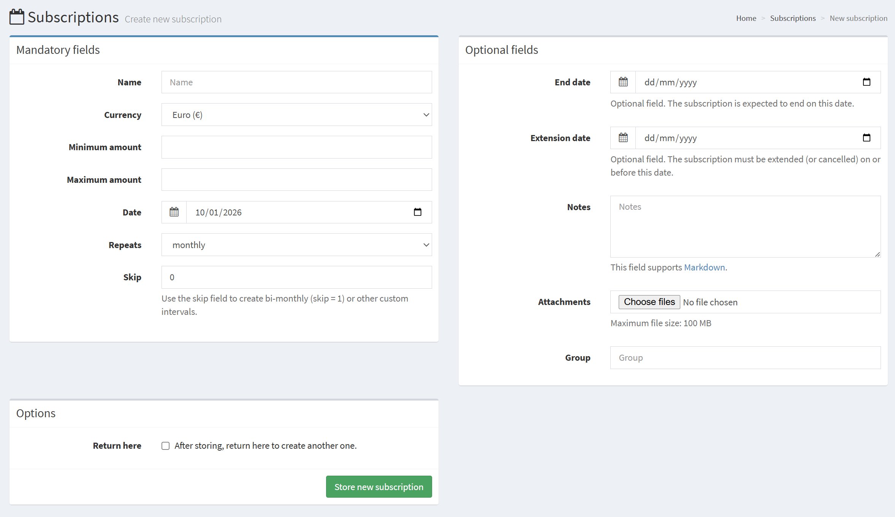
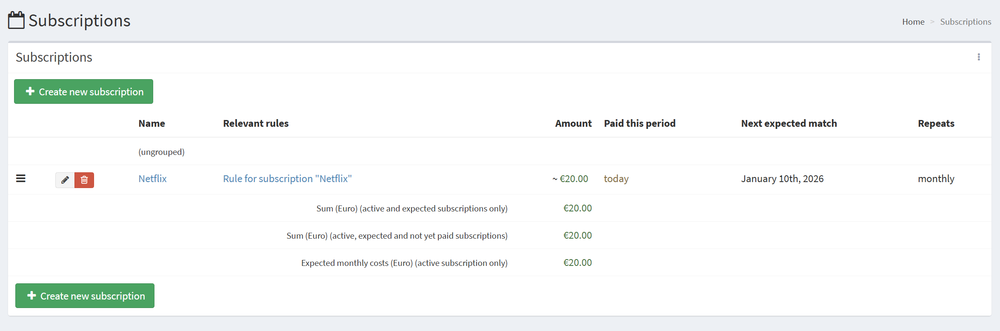
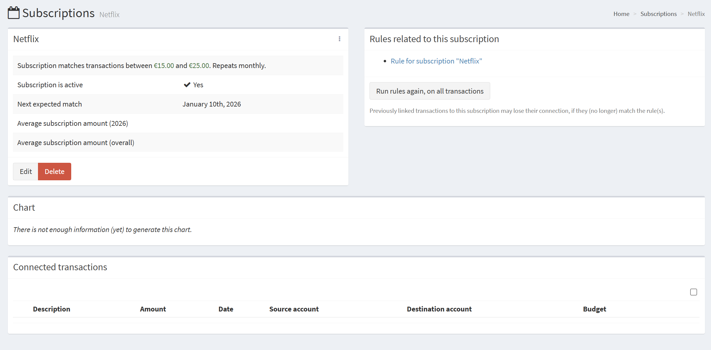
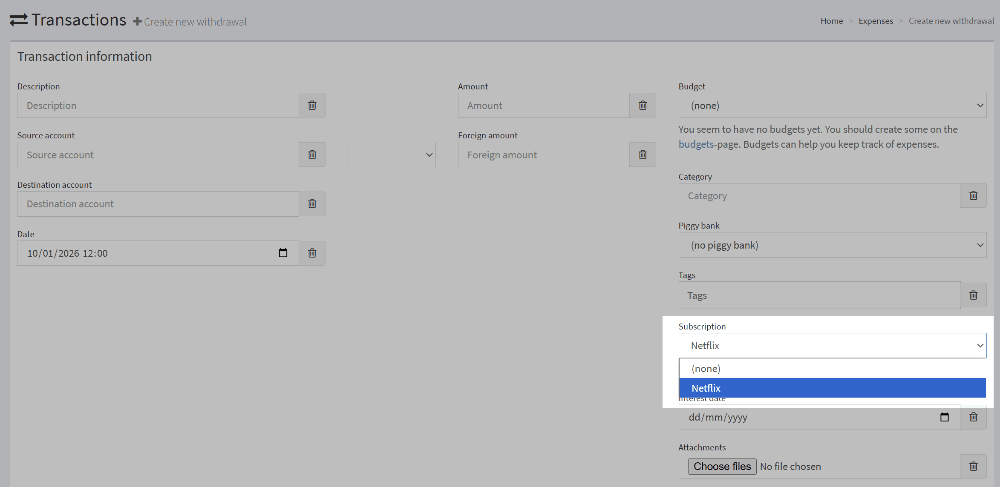
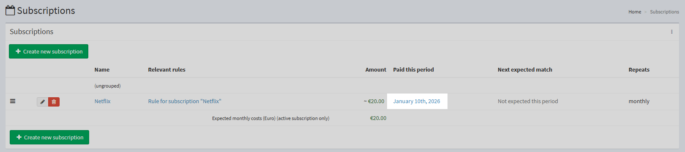
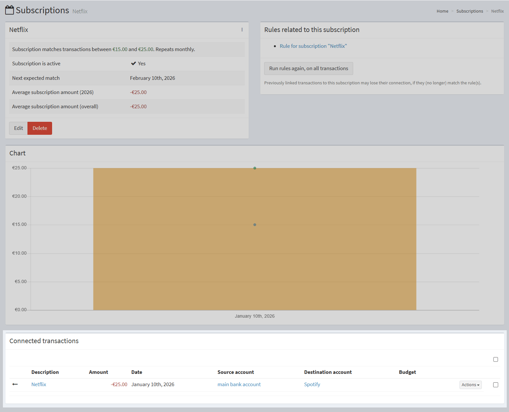
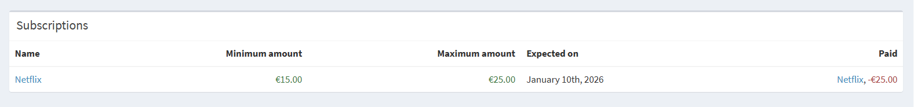

# Manage a subscription

!!! tip
    I've not yet finished writing this tutorial. Some items may not be filled in yet. I apologize for the inconvenience. Please refer to the [support page](../../explanation/support.md) if you have questions.

You can use subscriptions to track regular income from your accounts to any third party. To read more about subscriptions, see also:

- [An explanation about subscriptions](../../explanation/financial-concepts/subscriptions.md)
- [How to manage subscriptions](../../how-to/firefly-iii/finances/subscriptions.md)

## Create your first subscription

In the left-hand menu, go to Subscriptions, and press "Create new subscription". You can also use the right-hand menu, where you can press "Create subscription".

In either case, you see this screen:

Fill in the name and the expected amount of the subscription. The actual amount of a transaction linked to this subscription is always allowed to be more or less, but these amounts are used by Firefly III to calculate the expected amounts each period.

Be sure to indicate when you expect this subscription to arrive for the first time. If this subscription is already running you can also add a date in the past. The important thing is that Firefly III knows on which day of the period the subscription is supposed to arrive. On the next line, you indicate how often the subscription arrives. The default is "monthly" but you see a few options.

To set a subscription bi-weekly, or every 3 days, use the "skip"-field. For a bi-weekly subscription, fill in 1.

The optional fields on the right allow you to give the subscription an end date and an extension date. If you set up notifications according to [how to set up notifications](../../how-to/firefly-iii/advanced/notifications.md), Firefly III will warn you about the subscription's expiry/extension date. You can also add a group to your subscription. Any group that doesn't exist yet will be created.

### Create a rule

If you press "Store new subscription" you get redirected to the form to create a new rule. You can read about this on the page [how to manage rules](../../how-to/firefly-iii/features/rules.md). 

For this tutorial, we will skip this step. In the left-hand menu, click Subscriptions again.

## See it in the overview

In the overview, you will see your just-created subscription. It will look something like this:

If you click it, you will see the details of the subscription:

On the home page the subscription is also visible:

## Link a transaction

Now, if you make a withdrawal you can select the subscription to be linked to the transaction. Note that this will not work for transfers or deposits. You can only link subscriptions to withdrawals.

Note that it doesn't matter if the amount is not right for the subscription (too much or too little). Firefly III will still link the bill to the transaction. It's also okay to link transactions
to a bill that fall outside the bill's schedule. Firefly III will still link the bill to the transaction.

## See bill being paid

On the bill page, you can see that the transaction is linked to the bill, and the bill is now paid. You can also see the next expected payment date.

## Look it up in reports

If you go to the reports page, you can see the bill in the "default financial report". The monthly overview features all bills of that period and whether they were paid.

