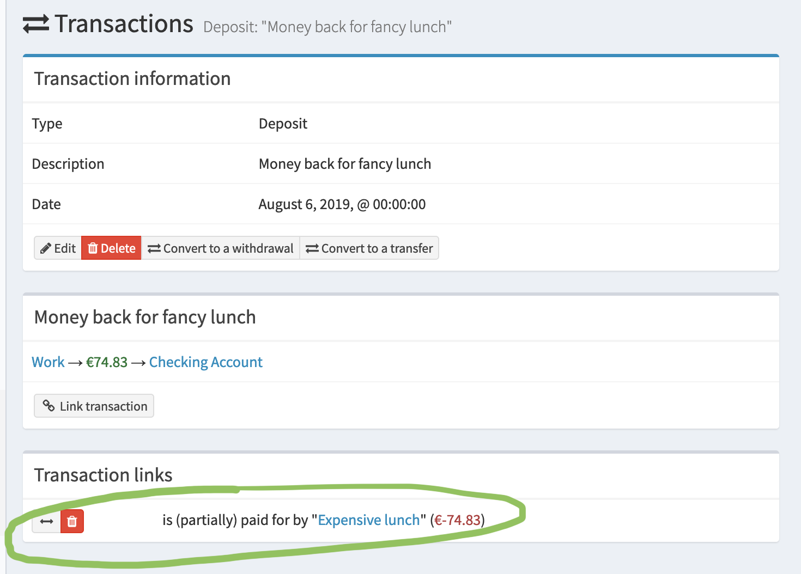
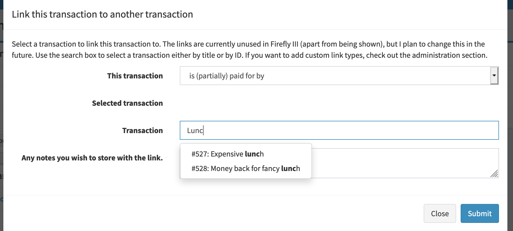

# Links

More often than not a transaction isn't just "a transaction" but a connected to some other transactions. Maybe you've been reimbursed money by your boss. Maybe an expense is paid back to you by an friend. Or perhaps a friend paid you back for something or other.

In Firefly III you can store these links between transactions. By default, four link types are available. You can see these under Administration &gt; Transaction links configuration.

* Is paid for by
* Is refunded by
* Is reimbursed by
* Relates to

These links work both ways. When transaction A has been refunded by transaction B, B is noted to refund A.

You can also add your own link types if you want to.

To make a link with another transaction, go to the overview of a transaction and use the "Link transaction" button under the transaction. If the transaction has been split, select the correct split to link. Select the correct type of link from the dropdown and select the transaction to be linked. Optionally you can add some comments.

You can remove or reverse a link once it has been created.

## Use of links

It is important to realise that links don't _do_ anything. They won't change your transactions, or subtract amounts or anything like that.

## Screenshots

