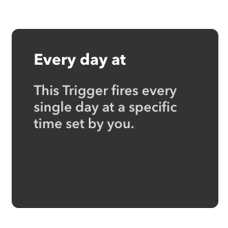
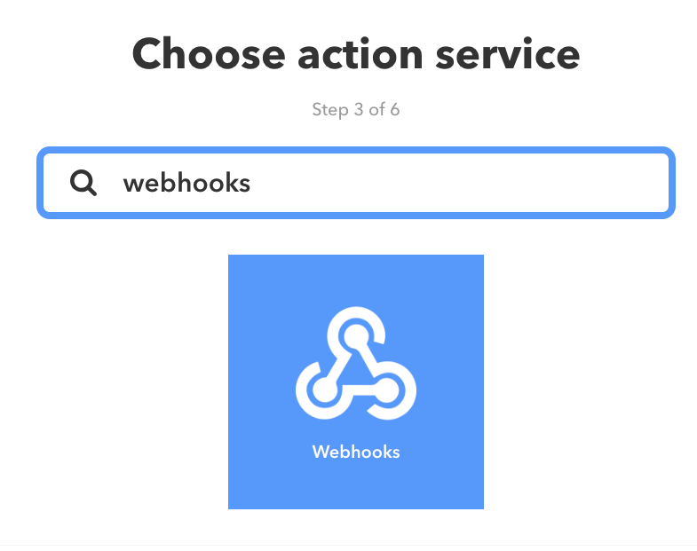
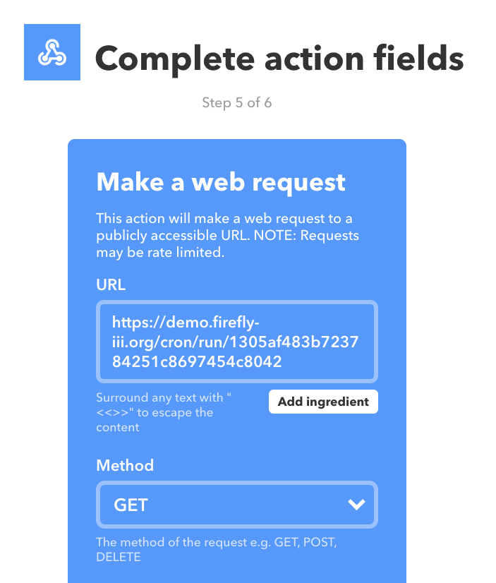
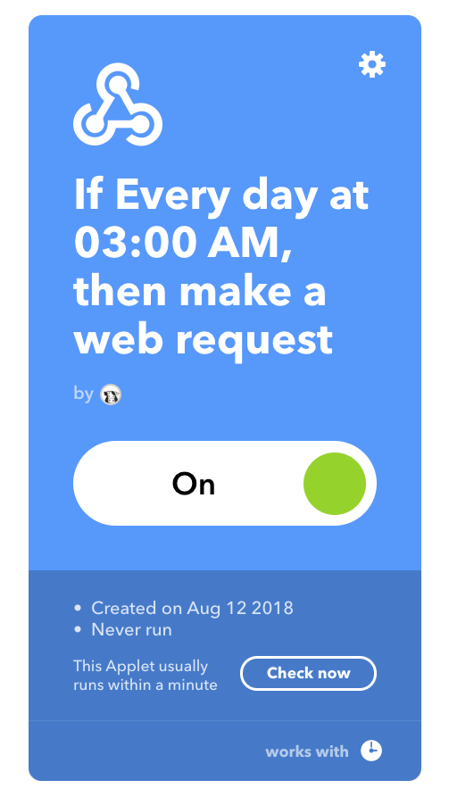
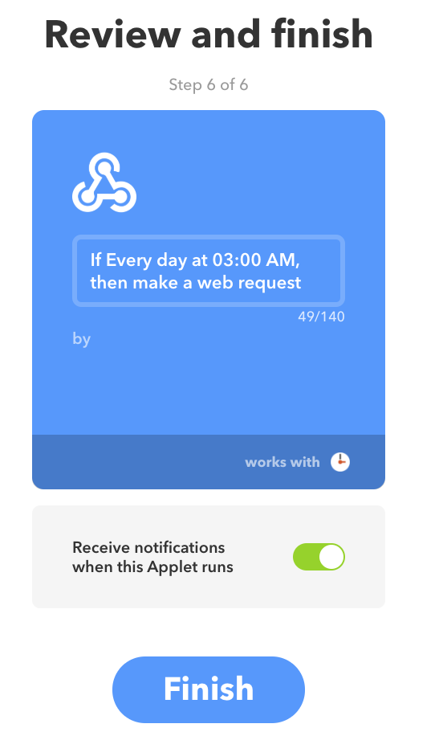

# Cron jobs

Firefly III supports several feature that requires you to run a cron job:

1. [Recurring transactions](https://docs.firefly-iii.org/advanced-concepts/recurring). Firefly III can automatically create transactions for you.  

   If Firefly III is to actually create these recurring transactions for you, someone or something must check every single day if a new transaction is due to be created.

2. [Automatic budgeting](https://docs.firefly-iii.org/concepts/budgets). Firefly III can automatically set your budgets for you.
3. [Telemetry](https://docs.firefly-iii.org/support/telemetry). When enabled \(telemetry is **opt-in**\), Firefly III will submit its telemetry data.

## Cron job that calls a command

If you are a bit of a Linux geek you can set up a cron job easily by running `crontab -e` on the command line. Some users may have to run `sudo crontab -u www-data -e` so the correct user will be referred to.

The content of the cron job must be as follows:

```text
# cron job for Firefly III
0 3 * * * /usr/bin/php /var/www/firefly-iii/artisan firefly-iii:cron
```

Of course, you must make sure to replace `/usr/bin/php` with _your_ path to PHP and replace `/var/www/firefly-iii/` with the path to _your_ Firefly III installation.

If you do this, Firefly III will generate the recurring transactions each night at 3AM.

## Cron job that requests a page

If for some reason you can't call scripts like this you can also use a tool called cURL which is available on most \(if not all\) linux systems.

The content of the cron job must be as follows:

```text
# cron job for Firefly III using cURL
0 3 * * * curl https://demo.firefly-iii.org/cron/run/<token>
```

Of course you must replace the URL with the URL of your own Firefly III installation. The `<token>` value can be found on your `/profile` under the "Command line token" header. This will prevent others from spamming your cron job URL.

## Make IFTTT do it

If you can't run a cron job, you can always make [If This, Then That \(IFTTT\)](https://ifttt.com) do it for you. This will only work if your Firefly III installation can be reached from the internet. Here's what you do.

Login to IFTTT \(or register a new account\) and create a new applet:


You will get this screen. Select "This":


Select "Date & Time":


Select "Every day at":



Set the time to 3AM:


Click on "That":


Use the search bar to search for "Webhooks".



Click on "make a web request"


Enter the URL in the following format:

`https://your-firefly-installation.com/cron/run/<token>`

Of course you must replace the URL with the URL of your own Firefly III installation. The `<token>` value can be found on your `/profile` under the "Command line token" header. This will prevent others from spamming your cron job URL.



Press Finish to finish up. You can change the title of the IFTTT applet into something more descriptive, if you want to.



You will see a final overview



Press Finish, and you're done!

## Cron jobs in Docker

The Docker image does _not_ support cron jobs. This is by design, because Docker images should do as little as possible. There are several solutions.

### Call the cron job from outside the Docker container

Use any tool or system to call the URL as documented above.

### Call the cron job from the host system

The command would be something like this:

```text
0 3 * * * docker exec --user www-data <container> /usr/local/bin/php /var/www/firefly-iii/artisan firefly-iii:cron
```

Replace `<container>` with the container ID or with `firefly_iii_app` in case of Docker compose. If you want, you can replace `<container>` with this piece of code that will automatically insert the correct container ID. Keep in mind, it may need some fine tuning!

```text
$(docker container ls -a -f name=firefly --format="{{.ID}}")
```

### Run an image that calls the cron job

Here's an example:

```text
docker create --name=Firefly-Cronjob alpine sh -c "echo \"0 3 * * * wget <Firefly III URL>/cron/run/<TOKEN>\" | crontab - && crond -f -L /dev/stdout"
```

Of course, replace `<Firefly III URL>` with your Firefly III URL and replace `<TOKEN>` with your command line token. You can find it in your profile.

### Expand the docker-compose file

```text
cron:
  image: alpine
  command: sh -c "echo \"0 3 * * * wget https://<Firefly III URL>/cron/run/<TOKEN>\" | crontab - && crond -f -L /dev/stdout"
```

Of course too you replace `<Firefly III URL>` with your Firefly III URL and replace `<TOKEN>` with your command line token. You can find it in your profile.

