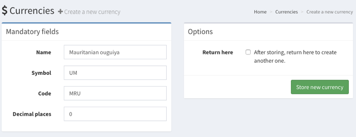
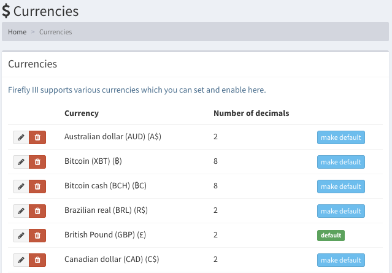
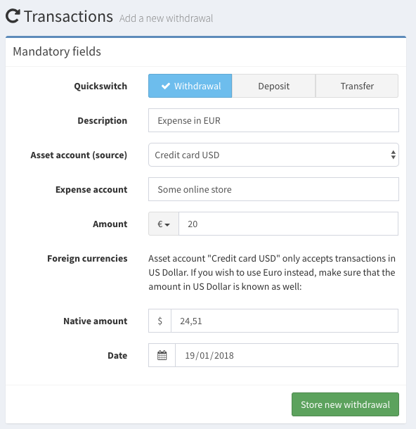
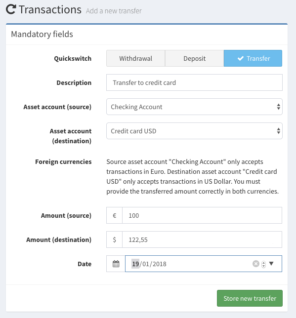

# Currencies

Firefly III supports as many currencies as you like. By default it ships with a variety of currencies, including crypto currencies.

You can add your own currencies if you're missing one.

Currencies are disabled by default, meaning that you cannot use them when creating asset accounts or transactions. You must enable them first.

## Adding currencies

Under Options &gt; Preferences you will find the "Currencies" page. When you are an admin, you will see the button "Create a new currency". You should enter some details such as the name, the symbol of the currency and of course the currency code \(preferrably according to the [ISO 4217](https://www.currency-iso.org/dam/downloads/lists/list_one.xml) standard\).

Currencies have decimal places. Most have 2, like the Euro. Notable exceptions are Bitcoin \(8\) and the Mauritanian ouguiya \(no decimals\). Both are supported by Firefly III. Bitcoin is present by default, but not enabled.

New currencies added through this form will be enabled for use.

## Set the default currency

Firefly III support multiple currencies but it requires one default currency. When you install Firefly III this is the Euro. You can change this if you want to.

## Set currency for asset accounts

Asset accounts have one main currency. My personal bank accounts are in Euro. But I have a credit card in USD. You can set this when you create or edit an asset account. This is important when you create or import transactions.

## Creating transactions

When you try to create a transaction in Euro's on an asset account that in US Dollars, you must set the amount in both USD and EUR.

## Creating transfers

When you create a transfer between an account in EUR and USD \(or other currencies\) you must also indicate the amount transferred in both currencies.

