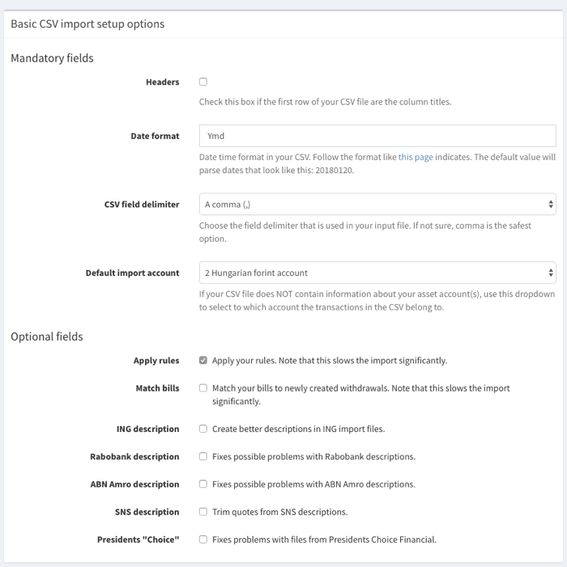
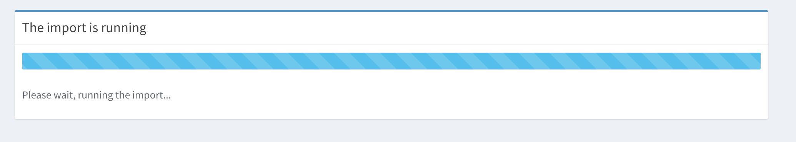
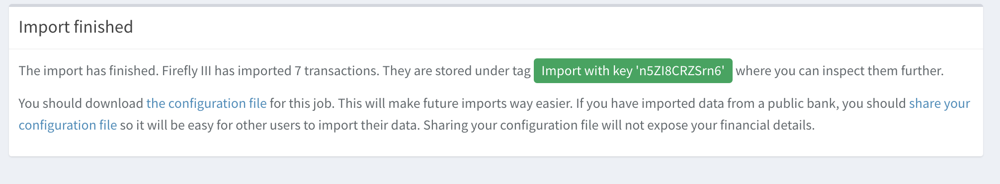

# Import CSV files

Firefly III can import data from CSV files. It uses a very clever system inspired by [Atlassian JIRA](https://www.atlassian.com/software/jira) to do so.

Before you continue reading the "how to" below, check out the **best practices** at the bottom of this page as well!

## Select a file

Find your file and upload it. There is no need to upload a "configuration file". You will see what this is for in a later step.


## Configure your file

There are some basic settings required before you can continue. Most are pretty obvious but here are some pointers:

**Date format**

Most CSV files have dates like this: ``20170623``. Some have ``2017-06-23`` or ``06/23/2017``. The date format must correspond to the date. Check [the parameters](https://secure.php.net/manual/en/datetime.createfromformat.php#refsect1-datetime.createfromformat-parameters) carefully.

** Optional fields** 

If you have rules they can executed automatically. This could prove to be slow, however. Other options are bank-specific fixes because most banks create very bad CSV files.



## Select column roles

In CSV files, each column contains a specific type of information. However, Firefly III does not know which information. Therefor, the next step involves telling Firefly III what each column is about. In the screenshot you can see how I indicate for each column what its role is. 

Notice how I've set some columns to be "mapped". This can be very useful for stuff like budgets, account names and other indicators.

Make sure you set at least one column to Date, one column to Description and one to Amount.


## Mapping data

A use case a lot of people run into is that their data is polluted somehow. For example, consider this list of Dutch super markets, extracted from a CSV file.

* ``ALBERT HEIJN 2101 ARNHEM``
* ``ALBERT HEIJN 3532 HEERENVEEN``
* ``ALBERT HEIJN 4022 AMSTERDA``

It's obvious these are the same super market: Albert Heijn. Yet Firefly III would create separate expense accounts for each one. This is where mapping comes in. In the previous step, I gave one column the role "Opposing account (name)" which comes in handy now.

Each of these combinations will now be linked to "Albert Heijn". I can do this with other fields as well, optimizing my import.


### Mapping asset accounts

Take extra care in mapping your asset accounts to the entries in your CSV file. Take the time to match IBAN's, account numbers and account names to the appropriate accounts in your Firefly III database. If you do this right, Firefly III will automatically create transfers between asset accounts.

### Detecting duplicate transactions

Firefly III automatically detects duplicate lines in your files and will refuse to import them. This behavior is also present when you delete the transaction; it will not be imported again. This is by design. 

Firefly III can also detect duplicates *over different files*. This behavior can be useful when you're importing two CSV files: ``account_A.csv`` and ``account_B.csv``. If it so happens that a transaction is mentioned in both files (so it goes from A to B in one file and from B to A in the other) it will still not be imported. This happens when every detail is the same (amount, date, description, accounts).

## Running the import

Once you have set up everything, you are ready to import your data. This could take a while. You can see what is happening while the import is running:



## Finishing up



Once the import is complete, you can find the results under the linked tag.

You can download the configuration file. This will prevent you from having to start ALL over when the import fails. If you download from common banks, these files can be shared in the [configuration center](https://github.com/firefly-iii/import-configurations) where other users may benefit from them as well.


## Import over command line

When you have a CSV file **and** a configuration file, you can run an import over the command line with the following command:

```bash
php artisan firefly-iii:csv-import
```

It has two mandatory arguments:

* The location of the CSV file
* The location of the configuration file.

There are also some options:

* `--token=<token>` set this to the token you can find on your profile page. The import will not work without it.

The command then becomes:

```bash
php artisan firefly-iii:csv-import file.csv config.json --token=<token>
```

You can read more about this command in the help text.

```php
php artisan help firefly-iii:csv-import
```

## Best practices

So you want to import data into Firefly III? And you have a CSV file from your banks? Or several? Well, here are some tips and tricks to help you get started.

- First of all, create all of the accounts (including their IBANs) that you have. Any savings account, checking account, anything. Make sure you include closed accounts too. 
- Then, under "Expense accounts", create entries for the places you send money to. The top 10 will do. Think about shops, magazine subscriptions, water, gas, power, internet company, anything. 
- Under "Revenue accounts", create entries for the accounts that give you money. Your boss, the government, your friends perhaps?

Then, start the import process as it is described on this page.

- Use the "map this value" checkbox for any textual value except the description and the notes. Thank me later.
- Try a few lines at a time to see if it works OK. Firefly III will not import duplicates so don't worry.
- Check out the section on :ref:`rules <rules>` to learn how to auto-organise everything.

The final tip about importing in Firefly III is:

- Don't.

I'm actually serious. Just wait for the first day of the next month and start entering all your transactions by hand. It will give you more insight in your finances than you thought possible. I could know, my first transaction in Firefly III is from the 1st of Januari 2013(!) and I never imported a single line. 

Remember: you can't change the past and if you're making financial mistakes as we speak writing them down will help already.
