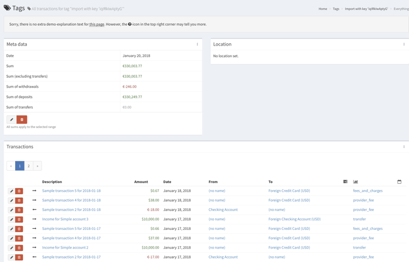

# Import using Spectre / Salt Edge

Firefly III supports the [Spectre API](https://www.saltedge.com/products/spectre), an API for financial apps that will connect you to thousands of banks all across the world. Chances are your bank is supported too.

To get it working in Firefly III you need [an account on their website](https://www.saltedge.com/client_users/sign_up>). Make sure you get that first.

As a side note: please realize that Spectre isn't meant for end users, or for tools like Firefly III. Spectre's target audience is large corporations who want to process lots of transactions. But it works and when we all keep quiet about what we use it for nobody will notice.

However, test access is perpetual as far as I know and won't cost you anything.

## First use

Once you have an account, it will be set to "pending mode". You can already use it in Firefly III, but only to access fake banks. You have to [upgrade to get test access](https://www.saltedge.com/test_access>). You should mention that you use Firefly III. It could take some days to go from pending to actual live access.

## Import data

The Spectre API has some secrets that you must share with Firefly III in order to continue. The first time you use the Spectre API you must enter this data into Firefly III.

Once you have done so, you will be forwarded to Spectre where you can select your bank, and login. This all happens on their site, so Firefly III will not (and cannot) touch your login data.

When you are back in Firefly III, it will show you the accounts Spectre has found and asks you if you want to import the data found:

After you have selected the correct accounts, Firefly III will import the data:

Once this process is complete you can find the imported transactions in your administration.

## Spectre costs

The Spectre API is not really suitable for an application like Firefly III. Each user must get their own API keys because a tool like Firefly III cannot provide a central source for such things. It is self-hosted after all. Conversely, each user must request test access to the Spectre API and eventually pay for access to the API.
